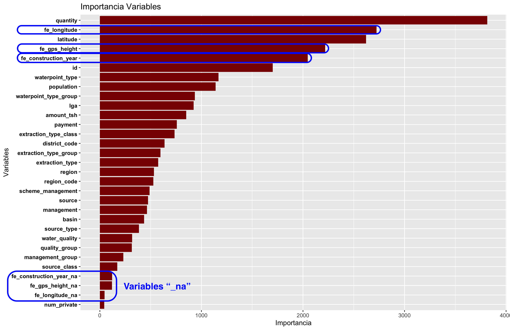

```{r setup, include=FALSE}
knitr::opts_chunk$set(echo = TRUE)
```

__Nota__: para la realización de la práctica, y a lo largo del concurso, __se ha tomado como base el _score_ obtenido en el modelo 2 realizado en clase:__

1. Selección de variables numéricas y categóricas (con al menos dos categorías y menos de 1000), además de descartar las variables duplicadas _payment_type_ y _quantity_group_, obteniendo la siguiente puntuación:

```{r, echo=FALSE}
knitr::kable(data.frame("Train accuracy" = 0.8168687, 
                        "Data Submission" = 0.8128,
                        row.names = c("Num + Cat (> 1 & < 1000) sin duplicados")),
             align = 'c')
```

# 1. Carga de datos y librerías

Para la realización de la práctica, los ficheros utilizados son los siguientes:

1. _train_values.csv_: __fichero con el conjunto de variables y observaciones con los que entrenar el modelo__.

2. _train_labels.csv_: __fichero con las variables objetivo de cada una de las observaciones en _train_values.csv___:

* 2.1 _functional_

* 2.2 _non functional_

* 2.3 _functional needs repair_

3. _test_values.csv_: __fichero de prueba con el que maximizar las predicciones obtenidas con el correspondiente modelo__

En relación con las librerías empleadas, debemos destacar las siguientes:

```{r}
#--- Librerias empleadas
suppressPackageStartupMessages({
  library(dplyr)           # Manipulacion de datos 
  library(data.table)      # Lectura y escritura de ficheros
  library(ggplot2)         # Representacion grafica
  library(inspectdf)       # EDAs automaticos
  library(ranger)          # randomForest (+ rapido que caret)
  library(forcats)         # Tratamiento de variables categoricas
  library(tictoc)          # Calculo de tiempo de ejecucion
  library(missRanger)      # Imputacion de valores NA
  library(knitr)           # Generacion de informes (formateo de tablas)
  library(gmt)             # Calculo de la distancia geografica
  library(stringi)         # Tratamiento de strings
  library(FeatureHashing)  # Hashing Encoding
  library(dataPreparation) # Target encoding
  library(embed)           # Word-Embeddings
  library(recipes)         # Definicion de recetas (preprocesamiento de datos + FE)
})
```
```{r}
#--- Carga de ficheros train y test
dattrainOr    <- fread(file = "../data/train_values.csv", data.table = FALSE )
dattrainLabOr <- fread(file = "../data/train_labels.csv", data.table = FALSE )
dattestOr     <- fread(file = "../data/test_values.csv", data.table = FALSE  )
```

# 2. Desarrollo durante el concurso

## 2.1 Análisis de variables existentes
En primer lugar, en base a las funciones disponibles en la librería _inspectdf_, __se extrajo un esquema inicial con las variables existentes en el conjunto de datos y su correspondiente tipo__:

```{r, fig.align='center'}
# Analizamos el tipo de dato en cada variable
show_plot(inspect_types(dattrainOr))
```
En conjunto, nos encontramos con:

1. __27 variables variables de tipo carácter (categóricas)__
2. __10 variables numéricas (entre _integer_ y _numeric_)__
3. __2 variables lógicas__
4. __1 variable tipo fecha__

Por tanto, del mismo modo que lo realizado en el modelo 2:

1. __Conservamos únicamente las variables numéricas y categóricas con más de uno y menos de 100 valores diferentes__:

```{r}
#-- Variables categoricas
datcat_df <- dattrainOr %>% select(where(is.character))
```

```{r}
# Mediante un bucle for, 
numlev_df <- data.frame(
                          "vars" = names(datcat_df),
                           "levels" = apply(datcat_df, 2, 
                                  function(x) length(unique(x)))
                          
                        )
# Eliminamos los nombres de fila
rownames(numlev_df) <- NULL

kable(numlev_df %>% arrange(levels))
```

Por tanto, escogemos desde la variable _source_class_ hasta _lga_, dado que _recorded_by_ solo presenta una única categoría:

```{r}
#-- Conservamos variables con categorias > 1 & < 1000
vars_gd <- numlev_df %>%
  filter(levels < 1000, levels > 1) %>% 
  select(vars)
datcat_gd <- datcat_df[ , vars_gd$vars]
```

```{r}
#-- Variables numericas
datnum_df <- dattrainOr %>% select(where(is.numeric))
```

```{r}
# Unificamos ambos tipos de variables...
datnumcat_df <- cbind(datnum_df, datcat_gd)
```

```{r}
# ...Como tambien la variable objetivo
dattrainOrlab <- merge(
  datnumcat_df, dattrainLabOr,
  by.x = c('id'), by.y = c('id'),
  sort = FALSE
)
```

2. __Eliminación de variables con información duplicada__, concretamente _payment_type_ y _quantity_group_:

```{r}
dattrainOrlab$payment_type <- NULL
dattrainOrlab$quantity_group <- NULL
```

## 2.1 Tratamiento de valores anómalos

Una vez pre-procesado el conjunto de entrenamiento, una de las primeras ideas que se tuvo en cuenta fue __el tratamiento de valores anómalos, concretamente a cero, de determinadas variables__, anotados durante la primera fase de análisis exploratorio realizada en clase:

1. _construction_year_

2. _gps_height_: en el caso de la altura GPS, __no se han considerado los valores negativos como valores anómalos__, principalmente porque, traslando el problema a un entorno real, es posible la existencia de alturas negativas (regiones situadas por debajo del nivel del mar).

3. _longitude_

Sobre dichas variables podemos observar en los siguientes histogramas una elevada concentración de valores a cero:

```{r, fig.align = 'center', fig.width=8}
# Graficos de distribucion
# Histograms for numeric columns
show_plot(
  inspect_num(dattrainOrlab[c("construction_year",
                              "gps_height",
                              "longitude")])
  
)
```

Por tanto, para eliminar y posteriormente imputar dichos ceros, __haremos uso de una función denominada impute_zeros__, la cual permite establecer inicialmente a NA los valores a cero, así como su posterior imputación haciendo uso de la librería _missRanger_.

__Nota__: a lo largo de la memoria se definen varias funciones que se emplean comunmente tanto en el concurso como en el desarrollo individual, evitando con ello la redundancia de código.

```{r}
# Funcion para la imputacion de ceros con missRanger
impute_zeros <- function(data, column, k, num_trees, impute = TRUE, seed = 1234) {
  new_feature <- paste0("fe_", column)
  
  data[, new_feature] <- data[, column]
  data[, new_feature] <- ifelse( 
                            data[, new_feature] == 0, 
                            NA, 
                            data[, new_feature]
  )
  original_data       <- data[, new_feature]
  
  data[, column]      <- NULL
  
  if (impute == TRUE) {
    data_imp <- missRanger(
                            data,  
                            pmm.k = k,
                            num.trees = num_trees,
                            seed = seed
                           )
    # Finalmente, creamos una nueva columna binaria
    # 1 = el valor era NA; 0 = No
    new_feature_na      <- paste0("fe_", column, "_na")
    data_imp[, new_feature_na] <- ifelse(
                                    is.na(original_data),
                                    1,
                                    0
    )
  }
  return(data_imp)
}
```

Una vez definida la funcion, imputamos cada una de las columnas anteriores, __no sin antes eliminar la columna _status_group_, con el objetivo de evitar que la imputación también dependa del valor de la variable objetivo__. Además, en lugar de utilizar k = 3 como número de vecinos, durante el concurso se aumentó dicho valor a 5, con el objetivo de comprobar si el resultado mejoraba con respecto a lo obtenido en clase:

```{r}
# Almacenamos en un vector la variable objetivo
status_group_vector        <- dattrainOrlab$status_group
dattrainOrlab$status_group <- NULL
```
```{r, eval = FALSE}
#--- construction_year
# 
dattrainOrlab_imp <- impute_zeros(dattrainOrlab,
                                  column = "construction_year",
                                  k = 5,
                                  num_trees = 100)
```

```{r, eval = FALSE}
#--- gps_heigth
dattrainOrlab_imp <- impute_zeros(dattrainOrlab_imp,
                                  column = "gps_height",
                                  k = 5,
                                  num_trees = 100)
```

```{r, eval = FALSE}
#--- longitude
dattrainOrlab_imp <- impute_zeros(dattrainOrlab_imp,
                                  column = "longitude",
                                  k = 5,
                                  num_trees = 100)
```

Tras la imputación, añadimos nuevamente la variable objetivo al conjunto de entrenamiento:

```{r,eval=FALSE}
dattrainOrlab_imp$status_group <- status_group_vector
dattrainOrlab_imp$status_group <- as.factor(dattrainOrlab_imp$status_group)
```

En relación con el conjunto _test_, dado que no debemos aplicar la imputación de los valores _missing_ a partir del propio conjunto _test_, a cada valor NA (es decir, igual a cero), se tomó la decisión de __imputarlo por un valor muy diferente al resto de la población__, concretamente 99999, así como añadir una columna binaria adicional que indice si el valor imputado era o no un valor _missing_:

```{r, eval=FALSE}
dattestOr_imp <- dattestOr

for(column in c("construction_year", "gps_height", "longitude")) {
  new_feature <- paste0("fe_", column)
  dattestOr_imp[, new_feature] <- ifelse(
                                          dattestOr_imp[, column] == 0,
                                          99999,
                                          dattestOr_imp[, column]
  )
  dattestOr_imp[, column] <- NULL
  
  new_feature_na <- paste0("fe_", column, "_na")
  dattestOr_imp[, new_feature_na] <- ifelse(
                                          dattestOr_imp[, new_feature] == 99999,
                                          1,
                                          0
  ) 
}
```

Una vez imputadas las variables, por medio de la función _ranger_ creamos un primer modelo de _Random Forest_:

```{r}
# Funcion que devuelve un modelo Random Forest entrenado
fit_random_forest <- function(formula, data, num_trees = 500, mtry = NULL, seed = 1234) {
  tic()
  my_model <- ranger( 
    formula, 
    importance = 'impurity',
    data       = data,
    num.trees = num_trees,
    mtry = mtry,
    verbose = FALSE,
    seed = seed
  )
  # **Estimacion** del error / acierto **esperado**
  success <- 1 - my_model$prediction.error
  print(success)
  toc()
  
  return(my_model)
}
```

De forma adicional, creamos una función que permita crear un grafico con la importancia de las variables del modelo pasado como argumento, así como almacenar el gráfico en disco:

```{r}
#--- Funcion para pintar importancia de variables (ademas de guardar el grafico)
save_importance_ggplot <- function(model, path) {
  impor_df <- as.data.frame(model$variable.importance)
  names(impor_df)[1] <- c('Importance')
  impor_df$vars <- rownames(impor_df)
  rownames(impor_df) <- NULL
  
  print(ggplot(impor_df, aes(fct_reorder(vars, Importance), Importance)) +
    geom_col(group = 1, fill = "darkred") +
    coord_flip() + 
    labs(x = 'Variables', y = 'Importancia', title = 'Importancia Variables') +
    theme_bw())
  ggsave(path)
}
```

```{r, eval = FALSE}
formula    <- as.formula('status_group~.')

my_model_1 <- fit_random_forest(formula, dattrainOrlab_imp)
```
```
[1] 0.8101178
34.328 sec elapsed
```

Tras crear el modelo, guardamos el gráfico con la importancia de cada una de las variables:

```{r, eval=FALSE}
save_importance_ggplot(my_model_1, '../charts/01_num_cat_menos1000_todo_imp.png')
```



Analizando el gráfico de importancia, observamos que las variables imputadas (año de construcción, altura GPS y longitud) presentan una elevada importancia. No obstante, las variables "_na" no parecen aportar una importancia relevante al modelo. No obstante, realizamos las predicciones y comparamos el _score_ obtenido:

```{r}
#--- Funcion para realizar prediccion sobre el modelo pasado como parametro
make_predictions <- function(model, test_data) {
  # Prediccion
  my_pred <- predict(model, test_data)
  
  # Submission
  my_sub <- data.table(
    id = test_data[, "id"],
    status_group = my_pred$predictions
  )
  
  return(my_sub)
}
```
```{r, eval = FALSE}
my_sub_1 <- make_predictions(my_model_1, dattestOr_imp)
# guardo submission
fwrite(my_sub_1, file = "../submissions/01_num_cat_menos1000_todo_imp.csv")
```

```{r, echo=FALSE}
knitr::kable(data.frame("Train accuracy" = c(0.8168687, 0.8101178), 
                        "Data Submission" = c(0.8128, 0.8096),
            row.names = c("Num + Cat (> 1 & < 1000) sin duplicados",
            "Num + Cat (> 1 & < 1000) sin duplicados imp")),
align = 'c')
```

Como podemos comprobar, el hecho de imputar las variables anteriores no ha mejorado el modelo. Sin embargo, ¿Y si eliminamos las variables "_na" anteriores?

```{r, eval=FALSE}
dattrainOrlab_imp_sin_col_na <- dattrainOrlab_imp
# Eliminamos las columnas "_na"
dattrainOrlab_imp_sin_col_na$fe_construction_year_na <- NULL
dattrainOrlab_imp_sin_col_na$fe_gps_height_na        <- NULL
dattrainOrlab_imp_sin_col_na$fe_longitude_na         <- NULL

# Idem con los datos test
dattestOr_imp_sin_col_na    <- dattestOr_imp
# Eliminamos las columnas "_na"
dattestOr_imp_sin_col_na$fe_construction_year_na <- NULL
dattestOr_imp_sin_col_na$fe_gps_height_na        <- NULL
dattestOr_imp_sin_col_na$fe_longitude_na         <- NULL
```

```{r, eval = FALSE}
my_model_1_sin_cols_na <- fit_random_forest(formula, dattrainOrlab_imp_sin_col_na)
```

```
[1] 0.8105724
43.627 sec elapsed
```

En relación con el conjunto _train_, parece mejorar ligeramente (de 0.8101178 a 0.8105724). Analicemos el conjunto _test_:

```{r, eval = FALSE}
my_sub_1_sin_cols_na <- make_predictions(my_model_1_sin_cols_na, dattestOr_imp_sin_col_na)
# guardo submission
fwrite(my_sub_1_sin_cols_na, file = "../submissions/01_num_cat_menos1000_todo_imp_sin_cols_na.csv")
```

```{r, echo=FALSE}
knitr::kable(data.frame("Train accuracy" = c(0.8168687, 0.8101178, 0.8105724), 
                        "Data Submission" = c(0.8128, 0.8096, 0.8081),
            row.names = c("Num + Cat (> 1 & < 1000) sin duplicados",
            "Num + Cat (> 1 & < 1000) sin duplicados imp", 
            "Num + Cat (> 1 & < 1000) sin duplicados imp sin cols na")),
align = 'c')
```

Podemos comprobar que, pese a eliminar variables con muy poca importancia, el modelo empeora.

## 2.2 Creación de nuevas variables
En vistas a los resultados obtenidos en el apartado anterior, se decidió no imputar dichas variables y buscar una alternativa a la mejora del modelo. Para ello, se recurrió a la creación de nuevas variables o _feature engineering_:

1. _construction_year_: __antigüedad del pozo__, restando la fecha más reciente (2014) a cada uno de los valores.

2. _longitude_ y _latitude_: __distancia geográfica__. En lugar de la raíz cuadrada de la suma de las coordenadas al cuadrado, _R_ dispone de un paquete denominado _gmt_ con el que calcular la distancia geográfica de cada bomba al punto de referencia (0,0), obteniendo distancias más precisas que con un cálculo Euclideo.

3. _amount_tsh_ y _population_: analizando el gráfico de importancia del primer modelo, se comprobó que variables como la población o la cantidad de agua disponible no son especialmente relevantes. Como consecuencia, se propuso la creación de una nueva variable, basada en la __cantidad de agua que habría disponible por persona en cada pozo__, dividiendo la cantidad total de agua en cada observación ( _amount_tsh_ ) entre el total de población.

```{r}
#---- Feature Engineering
#---  Creacion de nuevas variables
#--   Antiguedad del pozo (2014 - fecha)
# Train
dattrainOrlab$fe_cyear <- 2014 - dattrainOrlab$construction_year

# Test
dattestOr$fe_cyear <- 2014 - dattestOr$construction_year
```
```{r}
#--   Distancia geografica al punto (0,0)
# geodist (latitud_origen, longitud_origen, latitud_destino, longitud_destino)
# Por defecto, las unidades estan expresadas en kilometros
# Train
dattrainOrlab$fe_dist <- geodist(dattrainOrlab$latitude, dattrainOrlab$longitude, 0, 0)

# Test
dattestOr$fe_dist <- geodist(dattestOr$latitude, dattestOr$longitude, 0, 0)
```
```{r}
#--  Cantidad de agua disponible por persona
# Train
dattrainOrlab$fe_cant_agua <- ifelse(dattrainOrlab$population == 0,
                                     0,
                                    round(dattrainOrlab$amount_tsh /
                                            dattrainOrlab$population, 3)
                              )

# Test
dattestOr$fe_cant_agua <- ifelse(dattestOr$population == 0,
                                 0,
                                round(dattestOr$amount_tsh /
                                      dattestOr$population, 3)
                              )
```

Una vez creadas las variables, entrenamos nuevamente el modelo _random forest_:

```{r}
# Inclimos la variable objetivo
dattrainOrlab$status_group <- status_group_vector
dattrainOrlab$status_group <- as.factor(dattrainOrlab$status_group)
```
```{r, eval = FALSE}
my_model_2 <- fit_random_forest(formula, dattrainOrlab)
```

A simple vista, el valor obtenido en el conjunto de entrenamiento mejora de 0.810 en el caso anterior a 0.812. Veamos el resultado obtenido en la _submission_:

```
[1] 0.8122391
42.519 sec elapsed
```

```{r, eval = FALSE}
#- Guardamos el grafico con la importancia del modelo
save_importance_ggplot(my_model_2, '../charts/02_num_cat_menos1000_fe_cyear_dist_cant_agua.png')
```


De forma general, las variables creadas se sitúan entre las variables con mayor importancia (a excepción de _fe_cant_agua_). A continuación, si analizamos las predicciones obtenidas en el conjunto test:

```{r, eval = FALSE}
my_sub_2 <- make_predictions(my_model_2, dattestOr)
# guardo submission
fwrite(my_sub_2, file = "../submissions/02_num_cat_menos1000_fe_cyear_dist_cant_agua.csv")
```

```{r, echo=FALSE}
knitr::kable(data.frame("Train accuracy" = c(0.8168687, 0.8101178, 0.8105724, 0.8122391), 
                        "Data Submission" = c(0.8128, 0.8096, 0.8081, 0.8174),
            row.names = c("Num + Cat (> 1 & < 1000) sin duplicados",
            "Num + Cat (> 1 & < 1000) sin duplicados imp", 
            "Num + Cat (> 1 & < 1000) sin duplicados imp sin cols na",
            "Num + Cat (> 1 & < 1000) fe cyear + dist + cant_agua")),
align = 'c')
```

## 2.3 Inclusión de _date_recorded_

Con la inclusión de las nuevas variables, el resultado mejoró con respecto a los dos _submission_ anteriores, por lo que se decidió mantener cada una ellas. En relación con la siguiente prueba, se tomó la decisión de incluir una variable adicional que hasta el momento no se había tenido en cuenta: _date_recorded_. Dado que la variable se encuentra en formato fecha, en lugar de incluir directamente el campo se dividió en un total de tres nuevas variables:

1. __Año__
2. __Mes__
3. __Diferencia entre la fecha de observación y la fecha de construcción de la bomba__, de forma que se pueda tener una columna que indique su antigüedad en el momento en el que se insertó la fila:

```{r}
#-- date_recorded --> año
#   Train
dattrainOrlab$fe_dr_year <- year(dattrainOr$date_recorded)

#   Test
dattestOr$fe_dr_year     <- year(dattestOr$date_recorded)
```

```{r}
#-- date_recorded --> mes
#   Train
dattrainOrlab$fe_dr_month <- month(dattrainOr$date_recorded)

#   Test
dattestOr$fe_dr_month     <- month(dattestOr$date_recorded)
```

En relación a la diferencia entre _date_recorded_ y _construction_year_, llamó la atención la __diferencia negativa entre en algunas observaciones__, es decir, bombas de agua en las que la fecha de registro fue posterior a la fecha de su construcción:

```{r}
#-- date_recorded --> año date_recorded - año construction_date
#   Train
dattrainOrlab$fe_dr_year_cyear_diff <- dattrainOrlab$fe_dr_year - dattrainOrlab$construction_year

#   Test
dattestOr$fe_dr_year_cyear_diff     <- dattestOr$fe_dr_year - dattestOr$construction_year
```

```{r}
sum(dattrainOrlab$fe_dr_year_cyear_diff < 0) # Train
sum(dattestOr$fe_dr_year_cyear_diff < 0)     # Test
```

Nuevamente, tras crear las variables entrenamos el modelo _random forest_:

```{r, eval = FALSE}
#-- Modelo 3
my_model_3 <- fit_random_forest(formula, dattrainOrlab)
```

```
[1] 0.8115152
40.562 sec elapsed
```

En relación al conjunto _train_ anterior, ha mejorado considerablemente ¿Y en relación gráfico de importancia?

```{r, eval = FALSE}
#- Guardamos el grafico con la importancia del modelo
save_importance_ggplot(my_model_3, '../charts/03_num_cat_menos1000_fe_cyear_dist_cant_agua_dr_year_month_old.png')
```


Salvo la variable _fe_dr_year_ (año de _date_recorded_), por lo general son variables relevantes. Además, si analizamos el conjunto _test_:

```{r, eval=FALSE}
my_sub_3 <- make_predictions(my_model_3, dattestOr)
# guardo submission
fwrite(my_sub_3, 
    file = "../submissions/03_num_cat_menos1000_fe_cyear_dist_cant_agua_dr_year_month_old.csv")
```

```{r, echo=FALSE}
knitr::kable(data.frame("Train accuracy" = c(0.8168687, 0.8101178, 0.8105724, 0.8122391, 0.8115152), 
                        "Data Submission" = c(0.8128, 0.8096, 0.8081, 0.8174, 0.8176),
            row.names = c("Num + Cat (> 1 & < 1000) sin duplicados",
            "Num + Cat (> 1 & < 1000) sin duplicados imp", 
            "Num + Cat (> 1 & < 1000) sin duplicados imp sin cols na",
            "Num + Cat (> 1 & < 1000) fe cyear + dist + cant_agua",
            "Num + Cat (> 1 & < 1000) fe cyear + dist + cant_agua + dr_year + dr_month + abs(dr_year -cyear)")),
align = 'c')
```

Por lo general, __el modelo ha mejorado de 0.8174 a 0.8176__. Sin embargo, no todas las variables son de especial importancia, como es el caso de _fe_dr_year_ ¿Y si eliminamos dicha variable?

```{r}
dattrainOrlab$fe_dr_year <- NULL
dattestOr$fe_dr_year     <- NULL
```

```{r, eval=FALSE}
# Calculamos el nuevo modelo
my_model_3_sin_dr_year <- fit_random_forest(formula, dattrainOrlab)
```

```
[1] 0.812138
39.71 sec elapsed
```

```{r, eval=FALSE}
my_sub_3_sin_dr_year <- make_predictions(my_model_3_sin_dr_year, dattestOr)
# guardo submission
fwrite(my_sub_3_sin_dr_year, 
    file = "../submissions/03_num_cat_menos1000_fe_cyear_dist_cant_agua_month_old.csv")
```

```{r, echo=FALSE}
knitr::kable(data.frame("Train accuracy" = c(0.8168687, 0.8101178, 0.8105724, 0.8122391, 0.8124579, 0.812138), 
                        "Data Submission" = c(0.8128, 0.8096, 0.8081, 0.8174, 0.8176, 0.8176),
            row.names = c("Num + Cat (> 1 & < 1000) sin duplicados",
            "Num + Cat (> 1 & < 1000) sin duplicados imp", 
            "Num + Cat (> 1 & < 1000) sin duplicados imp sin cols na",
            "Num + Cat (> 1 & < 1000) fe cyear + dist + cant_agua",
            "Num + Cat (> 1 & < 1000) fe cyear + dist + cant_agua + dr_year + dr_month + dr_year -cyear",
            "Num + Cat (> 1 & < 1000) fe cyear + dist + cant_agua + dr_month + dr_year -cyear")),
align = 'c')
```

Prácticamente, obtuvimos el mismo resultado eliminando el año de _date_recorded_, por lo que se decidió no tener en cuenta dicha variable.

## 2.4 Tuneo modelo final

Como se ha podido comprobar en la tabla anterior, aumenta ligeramente el valor de __accuracy__ al añadir las dos nuevas variables. Por tanto, como última _submission realizada en clase_ se realizó un tuneo de hiperparámetros del modelo _random forest_, empleando todos los parámetros utilizados hasta el momento.

```{r, eval=FALSE}
my_ntree <- c(500, 600, 700, 800)
my_mtry  <- c(5, 6, 7, 10)
my_pars  <- expand.grid(my_ntree, my_mtry)
names(my_pars) <- c('myntree', 'mymtry')
my_pars$accuracy <- 0

for (i in 1:nrow(my_pars)) {
   my_model_tuning <- fit_random_forest(formula, dattrainOrlab,
                                        num_trees = my_pars$myntree[[i]],
                                        mtry = my_pars$mymtry[i])
   my_pars$accuracy[i] <- (1 - my_model_tuning$prediction.error)
}
rm(my_model_tuning)
```

Tras realizar el tuneo de hiperparámetros, comprobamos qué modelo obtiene un mayor _accuracy_:

```{r}
load("../rdata/00.RData")
my_pars[which(my_pars$accuracy == max(my_pars$accuracy)), ]
```

```{r, eval=FALSE}
#-- Entrenamos el modelo con 700 arboles y mtry = 6
my_model_4 <- fit_random_forest(formula, dattrainOrlab, num_trees = 700, mtry = 6)
```

```
[1] 0.8137374
76.683 sec elapsed
```

Finalmente, guardamos el gráfico de importancias y exportamos las predicciones obtenidas:

```{r, eval=FALSE}
#- Guardamos el grafico con la importancia del modelo
save_importance_ggplot(my_model_4, '../charts/04_num_cat_menos1000_fe_tunned.png')
```

```{r, eval=FALSE}
my_sub_4 <- make_predictions(my_model_4, dattestOr)
# guardo submission
fwrite(my_sub_4, 
    file = "../submissions/04_num_cat_menos1000_fe_tunned.csv")
```

```{r, echo=FALSE}
knitr::kable(data.frame("Train accuracy" = c(0.8168687, 0.8101178, 0.8105724, 0.8122391, 0.8124579, 0.812138, 0.8137374), 
                        "Data Submission" = c(0.8128, 0.8096, 0.8081, 0.8174, 0.8176, 0.8176, 0.8172),
            row.names = c("Num + Cat (> 1 & < 1000) sin duplicados",
            "Num + Cat (> 1 & < 1000) sin duplicados imp", 
            "Num + Cat (> 1 & < 1000) sin duplicados imp sin cols na",
            "Num + Cat (> 1 & < 1000) fe cyear + dist + cant_agua",
            "Num + Cat (> 1 & < 1000) fe cyear + dist + cant_agua + dr_year + dr_month + dr_year -cyear",
            "Num + Cat (> 1 & < 1000) fe cyear + dist + cant_agua + dr_month + dr_year -cyear", 
            "Num + Cat (> 1 & < 1000) fe + tunning random forest")),
align = 'c')
```

# 3. Mejora del modelo tras el concurso

## 3.1 Feature Engineering

Tras el concurso, por cuenta propia se ha decidido partir del mejor modelo obtenido hasta el momento, correspondiente con:

1. Variables numéricas
2. Variables categóricas
3. _Feature Engineering_: _cyear_, _dist_, _cant_agua_, _dr_month_ y _dr_year_ - _cyear_

Sobre dicho modelo, se ha obtenido una mejor puntuación de 0.812138 en el conjunto _train_ y 0.8176 en el conjunto de prueba, por lo que el objetivo consistirá en superar dicho _accuracy_, junto el mejor _accuracy_ alcanzado en el grupo en conjunto (0.8180), así como la mejor puntuación obtenida por el grupo ganador (0.8248).

```{r, echo=FALSE}
rm(list = ls())
```

__Importante__: con el objetivo de evitar redundancia de código, el conjunto de datos obtenidos en la fase anterior se han almacenado en ficheros csv denominados _train_values_concurso.csv_ y _test_values_concurso.csv_. Además, de ahora en adelante se trabajará con _data.table_ en lugar de _data.frames_, con fines únicamente didácticos (aprender una nueva estructura de datos):

```{r}
# Volvemos a cargar dattrainOr, ya que contiene la columna status_group
dattrainOr       <- fread(file = "../data/train_values.csv", data.table = FALSE)

dattrainOrlab    <- fread(file = "../data/train_values_concurso.csv", data.table = FALSE )
dattestOr        <- fread(file = "../data/test_values_concurso.csv", data.table = FALSE  )
```

Una vez cargados ambos datos (entrenamiento y prueba), se tomó la decisión de juntar ambos ficheros en una única variable (dat_completo), evitando de este modo la duplicidad en el código. Por tanto, y dado que el conjunto _test_ no dispone de la columna _status_group_, almacenamos la variable objetivo del conjunto _train_ en un vector:

```{r}
vector_status_group        <- dattrainOrlab$status_group
dattrainOrlab$status_group <- NULL

#-- Nos traemos funder, ward (menos de 2100 categorias)
#   Para el siguiente apartado
dattrainOrlab$funder <- dattrainOr$funder
dattrainOrlab$ward <- dattrainOr$ward

# Creamos el dataset completo (train y test unidos)
columnas_test  <- names(dattestOr)[names(dattestOr) %in% names(dattrainOrlab)]
datcompleto <- rbind(dattrainOrlab, dattestOr[, columnas_test])
datcompleto <- as.data.table(datcompleto)
```

Además, de cara a la posterior separación del conjunto _train_ y _test_ para el entrenamiento, almacenamos en una variable el número de fila __a partir del cual comienza el conjunto _test__:

```{r}
# El conjunto test empieza a partir de la 59401
# 50785: primer id del conjunto test
fila_test <- which(datcompleto$id == 50785)
```

### 3.1.1 Incluyendo variables < 2100 valores únicos

Hasta ahora, hemos incluido variables con menos de 1000 categorias únicas, esto es, hasta la variable _lga_. Durante el concurso, no se tuvieron en cuenta, dado que sel objetivo fue maximizar el _score_ del modelo sin necesidad de recurrir a variables con un alto número de categorías. Por ello, de cara a la parte individual se tomó la decisión de trabajar sobre dichos campos.

Con el objetivo de seguir un orden y __no incluir todas las variables "de forma abrupta"__, comenzamos con aquellas con menos de 2100 categorías, esto es, _funder_ y _ward_:

```{r}
#--- Niveles de las categoricas.
datcat_df <- as.data.frame(datcompleto %>% select(where(is.character)))

numlev_df <- data.frame()
for (i in 1:ncol(datcat_df)) {
  col_tmp <- datcat_df[, i]
  num_lev <- length(unique(col_tmp))
  numlev_df[i, 1] <- names(datcat_df)[i]
  numlev_df[i, 2] <- num_lev
}
names(numlev_df) <- c('vars', 'levels')
numlev_df %>% arrange(levels)
```

Dado que existen demasiadas categorías, podemos preguntarnos si realmente existen 2098 y 2141 valores unicos en _ward_ y _funder_, respectivamente. De hecho, podemos comprobar como algunas de las categorías se diferencian por tan solo una o dos palabras:

```
Lgcdg   - Lgcbg  # En el caso de funder
Magole  - Magoma # En el caso de ward
```

Es decir, se tratan de regiones "alfabeticamente" muy similares. Por tanto, ¿quién nos asegura que dos o más categorías se diferencien por tan solo un espacio en blanco, una palabra en mayúscula o por signos de puntuación? Como consecuencia, antes de procesar un modelo se tomó la decisión de __realizar una limpieza sobre ambas columnas, con el propósito de comprobar si se reduce el número de valores únicos__. Para ello, empleamos la librería __stringi__, creando una función que permita filtrar:

1. Mayúsculas
2. Espacios en blanco
3. Signos de puntuación

```{r}
# Funcion para limpieza de strings (vectorizado)
clean_text <- function(text) {
  stri_trans_tolower(
    stri_replace_all_regex(
      text, 
      pattern = "[ +\\p{Punct}]", 
      replacement = ""
      )
    )
}
```

Una vez creada la función,la aplicamos sobre el _data.table_:

```{r}
datcompleto[, fe_funder := clean_text(funder)][, fe_ward := clean_text(ward)]
```

Tras aplicar dicha función, comprobamos si el número de categorías se ha visto reducido:

```{r}
datcat_df <- as.data.frame(datcompleto %>% select(where(is.character)))

numlev_df <- data.frame()
for (i in 1:ncol(datcat_df)) {
  col_tmp <- datcat_df[, i]
  num_lev <- length(unique(col_tmp))
  numlev_df[i, 1] <- names(datcat_df)[i]
  numlev_df[i, 2] <- num_lev
}
names(numlev_df) <- c('vars', 'levels')
numlev_df %>% arrange(levels)
```

Analizando la salida anterior, podemos comprobar como el número de categorías se ha visto reducido ligeramente en ambas columnas:

1. _ward_  : de 2096 a 2098
2. _funder_: de 2141 a 2110

Una vez creadas las nuevas columnas, eliminamos las originales y lanzamos el modelo:

```{r}
datcompleto[, c("ward", "funder") := NULL]
```

```{r, eval=FALSE}
#-- Modelo
# Dividimos entre conjunto de entrenamiento y prueba
train <- datcompleto[c(1:fila_test-1),]
train$status_group <- vector_status_group
train$status_group <- as.factor(train$status_group)

test <- datcompleto[c(fila_test:nrow(datcompleto)),]

formula   <- as.formula("status_group~.")

# Empleamos la funcion fit_random_forest definida anteriormente
my_model_5 <- fit_random_forest(formula, train)
```

```
[1] 0.8149832
39.414 sec elapsed
```

Tras crear el modelo, echemos un vistazo a la importancia de las variables:

```{r, eval=FALSE}
save_importance_ggplot(my_model_5, '../charts/05_04_mas_fe_inst_funder_scheme_ward.png')
```


Observamos que ambas variables se sitúan entre las variables con mayor relevancia (importancia en torno a 1000). Veamos si con el conjunto _test_ obtenemos un mejor _score_:

```{r, eval=FALSE}
my_sub_5 <- make_predictions(my_model_5, dattestOr)
# guardo submission
fwrite(my_sub_5, 
    file = "../submissions/05_04_mas_fe_inst_funder_scheme_ward.csv")
```

```{r}
knitr::kable(data.frame("Train accuracy" = c('-', 0.8149832), 
                        "Data Submission" = c(0.8180, 0.8197),
                        row.names = c("Mejor accuracy en el concurso",
                                      "Num + Cat (> 1 & < 2100) fe anteriores + fe_funder + fe_ward")),
             align = 'c')
```

Aparentemente, hemos conseguido un mejor _score_ que el obtenido en clase.

### 3.1.2 Aplicando lumping sobre ward y funder (mediana)

Tras la mejora en el modelo anterior, todavía quedan demasiadas categorías en _ward_ y _funder_, concretamente 2098 y 2110 categorías, respectivamente. Además, si echamos un vistazo a la proporción de aparición de las diferentes categorías de cada variable, mediante la función _prop.table_:

```{r}
prop_categorias_ward   <- summary(c(prop.table(table(datcompleto[, fe_ward])))) # fe_ward
prop_categorias_ward
```

```{r}
prop_categorias_funder <- summary(c(prop.table(table(datcompleto[, fe_funder])))) # fe_funder
prop_categorias_funder
```

Observamos que __muchas de las categorías aperecen con muy poca frecuencia__. Por ejemplo, si nos fijamos en la mediana vemos que la mitad de las categorías de _fe_ward_ aparecen con una proporción igual o inferior a 3.37e-04, así como en _fe_funder_, con una proporción aún más pequeña (del orden de 1e-5).

Por tanto, una posibilidad sería __aplicar lumping sobre aquellas categorías con una proporción de aparición muy pequeña__, agrupándose en torno a una única categoría ( _other_ ). En un primer comienzo, podemos aplicarlo sobre la mediana. Por ejemplo, en el caso de la variable _ward_, dado que la mediana se sitúa en torno a 3.367e-04, aplicamos _lumping_ __a partir de aquellas categorías con una proporción inferior a 4e-04, de forma aproximada__, haciendo uso de la función _fct_lump_prop_ del paquete _forcats_:

```{r}
#-- fe_ward
datcompleto[, fe_ward := fct_lump_prop(datcompleto[,fe_ward], 4e-04, other_level = "other")]
datcompleto$fe_ward <- as.character(datcompleto$fe_ward)

# Pasamos de 2096 a 904 categorias (menos de la mitad de categorias)
sum(length(unique(datcompleto[, fe_ward])))
```

En el caso de _funder_, aproximamos a  2e-05:

```{r}
#-- fe_funder
datcompleto[, fe_funder := fct_lump_prop(datcompleto[,fe_funder], 2e-05, other_level = "other")]
datcompleto$fe_funder <- as.character(datcompleto$fe_funder)

# Pasamos de 2110 a 999 categorias (menos de la mitad de categorias)
sum(length(unique(datcompleto[, fe_funder])))
```

Como podemos comprobar, __conseguimos reducir significativamente el número de categorías en ambas variables__. Una vez aplicado _lumping_ sobre dichas columnas, lanzamos nuevamente un modelo _Random Forest_:

```{r, eval=FALSE}
#-- Modelo
# Dividimos entre conjunto de entrenamiento y prueba
train <- datcompleto[c(1:fila_test-1),]
train$status_group <- vector_status_group
train$status_group <- as.factor(train$status_group)

test <- datcompleto[c(fila_test:nrow(datcompleto)),]

formula   <- as.formula("status_group~.")

# Empleamos la funcion fit_random_forest definida anteriormente
my_model_6 <- fit_random_forest(formula, train)
```

```
[1] 0.8159764
39.081 sec elapsed
```

En relación con el modelo anterior, el hecho de disminuir el número de categorías ha mejorado el resultado en el conjunto _train_ (pasando de 0.8149832 a 0.8159764). A continuación, analicemos el conjunto _test_:

```{r, eval=FALSE}
my_sub_6 <- make_predictions(my_model_5, dattestOr)
# guardo submission
fwrite(my_sub_6, 
    file = "../submissions/06_lumping_y_fe_sobre_funder_ward_mediana.csv")
```

```{r}
knitr::kable(data.frame("Train accuracy" = c('-', 0.8149832, 0.8159764), 
                        "Data Submission" = c(0.8180, 0.8197, 0.8212),
                        row.names = c("Mejor accuracy en el concurso",
                                      "Num + Cat (> 1 & < 2100) fe anteriores + fe_funder + fe_ward",
                                      "Num + Cat (> 1 & < 2100) fe anteriores + lumping sobre funder + ward (mediana)")),
             align = 'c')
```

__Observamos que incluso en el conjunto _test_ el _score_ ha aumentado a 0.8212__.

### 3.1.3 Aplicando lumping sobre ward y funder (primer y tercer cuartil)

En el apartado anterior, aplicamos _lumping_ sobre aquellas categorías cuya proporción de aparición se situase por debajo de la mediana, aproximadamente. No obstante, ¿Y si aplicamos el punto de corte sobre el primer o tercer cuartil? Es decir, si recordamos la salida del _summary_ anterior:

```{r}
prop_categorias_ward   # fe_ward
```

```{r}
prop_categorias_funder # fe_funder
```

Podríamos aplicar _lumping_ sobre el primer cuartil, de forma aproximada, o bien sobre el tercer cuartil. De este modo, __podemos comprobar si agrupando un mayor o menor número de categorías conseguimos mejorar la puntuación__ ("jugar con el punto de corte").

#### 3.1.3.1 Sobre el primer cuartil

```{r, eval = FALSE}
#-- fe_ward (primer cuartil: 1.751e-04, aplicamos el punto de corte sobre 2e-04 aprox.)
datcompleto[, fe_ward := fct_lump_prop(datcompleto[,fe_ward], 2e-04, other_level = "other")]
datcompleto$fe_ward <- as.character(datcompleto$fe_ward)

# Pasamos de 2096 a 1483 categorias
sum(length(unique(datcompleto[, fe_ward])))
```

```
## [1] 1483
```

```{r, eval = FALSE}
#-- fe_funder (primer cuartil: 1.347e-05, aplicamos el punto de corte sobre 2e-05 aprox.)
datcompleto[, fe_funder := fct_lump_prop(datcompleto[,fe_funder], 2e-05, other_level = "other")]
datcompleto$fe_funder <- as.character(datcompleto$fe_funder)

# Pasamos de 2110 a 999 categorias (primer cuartil = mediana)
sum(length(unique(datcompleto[, fe_funder])))
```

```
## [1] 999
```

Una vez aplicado _lumping_, recalculamos el modelo:

```{r, eval = FALSE}
#-- Modelo
# Dividimos entre conjunto de entrenamiento y prueba
train <- datcompleto[c(1:fila_test-1),]
train$status_group <- vector_status_group
train$status_group <- as.factor(train$status_group)

test <- datcompleto[c(fila_test:nrow(datcompleto)),]

formula   <- as.formula("status_group~.")
# Resultado train: 0.8159259
my_model_7 <- fit_random_forest(formula,
                                train)

my_sub_7 <- make_predictions(my_model_7, test)

fwrite(my_sub_7, file = "./submissions/07_lumping_y_fe_sobre_funder_ward_primer_cuartil.csv")
# Score: 0.8196
```

```{r}
knitr::kable(data.frame("Train accuracy" = c(0.8159764, 0.8159259), 
                        "Data Submission" = c(0.8212, 0.8196),
                        row.names = c("lumping sobre mediana",
                                      "lumping sobre primer cuartil")),
             align = 'c')
```

Observamos que manteniendo un mayor número de categorías, el _score_ obtenido tanto en _train_ como en _test_ empeora.

#### 3.1.3.2 Sobre el tercer cuartil

```{r, eval = FALSE}
#-- fe_ward (primer cuartil: 6.330e-04, aplicamos el punto de corte sobre 7e-04 aprox.)
datcompleto[, fe_ward := fct_lump_prop(datcompleto[,fe_ward], 7e-04, other_level = "other")]
datcompleto$fe_ward <- as.character(datcompleto$fe_ward)

# Pasamos de 2096 a 452 categorias
sum(length(unique(datcompleto[, fe_ward])))
```

```
## [1] 452
```

```{r, eval = FALSE}
#-- fe_funder (primer cuartil: 9.428-05, aplicamos el punto de corte sobre 1e-04 aprox.)
datcompleto[, fe_funder := fct_lump_prop(datcompleto[,fe_funder], 1e-04, other_level = "other")]
datcompleto$fe_funder <- as.character(datcompleto$fe_funder)

# Pasamos de 2110 a 502 categorias
sum(length(unique(datcompleto[, fe_funder])))
```

```
## [1] 502
```

```{r, eval = FALSE}
#-- Modelo
# Dividimos entre conjunto de entrenamiento y prueba
train <- datcompleto[c(1:fila_test-1),]
train$status_group <- vector_status_group
train$status_group <- as.factor(train$status_group)

test <- datcompleto[c(fila_test:nrow(datcompleto)),]

formula   <- as.formula("status_group~.")
# Resultado train: 0.8146633
my_model_8 <- fit_random_forest(formula,
                                train)

my_sub_8 <- make_predictions(my_model_8, test)

fwrite(my_sub_8, file = "./submissions/08_lumping_y_fe_sobre_funder_ward_tercer_cuartil.csv")
# Score: 0.8203
```

```{r}
knitr::kable(data.frame("Train accuracy" = c(0.8159764, 0.8159259, 0.8146633), 
                        "Data Submission" = c(0.8212, 0.8196, 0.8203),
                        row.names = c("lumping sobre mediana",
                                      "lumping sobre primer cuartil",
                                      "lumping sobre tercer cuartil")),
             align = 'c')
```

Comprobamos que, pese a mejorar el _score_ del modelo al aplicar el punto de corte sobre el tercer cuartil, el resultado obtenido sobre la mediana continua siendo mejor.

Por tanto, __sobre las variables _fe_ward_ y _fe_funder_ aplicamos _lumping_ sobre la mediana de proporción de aparición de cada una de sus categorías__, reduciendo el número a 904 y 999, respectivamente.

```{r, echo=FALSE}
knitr::kable(data.frame("Train accuracy" = c('-', 0.8149832, 0.8159764, 0.8159259, 0.8146633), 
                        "Data Submission" = c(0.8180, 0.8197, 0.8212, 0.8196, 0.8203),
                        row.names = c("Mejor accuracy en el concurso",
                                      "Num + Cat (> 1 & < 2100) fe anteriores + fe_funder + fe_ward",
                                      "Num + Cat (> 1 & < 2100) fe anteriores + lumping sobre funder + ward (mediana)",
                                      "Num + Cat (> 1 & < 2100) fe anteriores + lumping sobre funder + ward (primer cuartil)",
                                      "Num + Cat (> 1 & < 2100) fe anteriores + lumping sobre funder + ward (tercer cuartil)")),
             align = 'c')
```

Pese a aplicar _lumping_ sobre ambas variables, continuamos teniendo demasiadas categorías: 904 en el caso de _fe_ward_ y 999 en el caso de _fe_funder_. Como consecuencia, se plantearon diversas alternativas con el fin de reducir nuevamente el número de valores únicos sobre dichas columnas, observando con ello si el _score_ obtenido mejora:

1. _Hashing encoding_

2. _Frecuencias absolutas_

3. _Target encoding_

4. _Word Embedding_


### 3.1.4 Aplicando hashing sobre fe_funder y fe_ward

También conocido como _Feature Hashing_, consiste en transformar un elevado conjunto de características en un vector, por medio de una función de transformación o _hash function_. No obstante, uno de los principales incovenientes de dicha técnica reside en el ratio de colisión o _collision rate_, es decir, __cuando dos categorías presentan el mismo resultado en la función hash__. Por tanto, __cuanto mayor sea el tamaño de la función _hash_, habrá un menor ratio de colisión__.

Para ello, haremos uso del paquete _FeatureHashing_ disponible en CRAN. Dicho paquete dispone de una función denominada _hash.size_, el cual indica __el tamaño mínimo (teórico) que permite reducir al mínimo el ratio de colisión entre valores _hash___:

```{r}
#-- Feature Hashing (tras aplicar lumping sobre funder y ward)
# Podemos elegir el tamaño minimo (teorico) que permite reducir el ratio de colision entre valores hash
tam_minimo <- hash.size(datcompleto[, c("fe_funder", "fe_ward")])
tam_minimo
```

La función nos indica que el tamaño mínimo es de 2048. A continuación, mediante la función _hashed.model.matrix_ creamos la matriz _hash_ correspondiente con la que indexar las categorías de las columnas _ward_ y _funder_:

```{r}
mat_hash   <- hashed.model.matrix(~., datcompleto[, c("fe_funder", "fe_ward")], tam_minimo, create.mapping = TRUE)

# Comprobamos el ratio de colisión
mean(duplicated(hash.mapping(mat_hash))) # 0.3520757
```

Comprobamos que el ratio de colisión obtenido no es demasiado alto (alrededor de 0.35). Una vez elaborada la matriz, debemos __sustituir los categorías originales por su valor _hash_ correspondiente__, haciendo uso de la función _hash.mapping_, encargada de devolver la equivalencia entre cada categoría y su valor _hash_:

```{r}
# Sustituimos las columnas fe_funder y fe_ward por su valor hash correspondiente
vector_hash <- hash.mapping(mat_hash)
mat_hash_dt <- data.table("feature" = names(vector_hash), 
                          "values" = vector_hash)

head(mat_hash_dt)
```

Una vez obtenida la matriz de equivalencias, sustituimos en el _data.table_ original:

```{r}
# Por defecto, hashed.model.matrix añade el nombre de columna a la variable
# De forma que debemos incluirlo tambien tanto en fe_funder como en fe_ward
# para hacer coincidir las categorias
datcompleto[, fe_ward := paste0("fe_ward", fe_ward)]
datcompleto[, fe_funder := paste0("fe_funder", fe_funder)]

datcompleto[mat_hash_dt, fe_ward_hashed := i.values,  on = .(fe_ward = feature)]
datcompleto[mat_hash_dt, fe_funder_hashed := i.values,  on = .(fe_funder = feature)]
```

Además, observamos cómo el número de "categorías" (valores _hash_) se reduce a 727 y 803 valores únicos:

```{r}
#- Numero de valores unicos en fe_ward_hashed
length(unique(datcompleto$fe_ward_hashed))   # 727 categoricas
#- Numero de valores unicos en fe_funder_hashed
length(unique(datcompleto$fe_funder_hashed)) # 803 categorias
```
```{r}
# Eliminamos las columnas fe_ward y fe_funder
datcompleto[, `:=`(fe_funder = NULL, fe_ward = NULL)]
```

Una vez reemplazadas las categorías, entrenamos un nuevo modelo:

```{r, eval = FALSE}
my_model_9 <- fit_random_forest(formula,
                                train)
```

```
[1] 0.8158418
35.099 sec elapsed
```

En relación al conjunto de entrenamiento, el _accuracy_ obtenido es similar al obtenido mediante _lumping_ (0.8159764). A continuación, guardamos la _submission_ y comprobamos su _score_ en DrivenData:

```{r, eval=FALSE}
my_sub_9 <- make_predictions(my_model_9, test)
# guardo submission
fwrite(my_sub_9, file = "./submissions/09_lumping_fe_y_hashing_sobre_funder_ward.csv")
```

```{r, echo=FALSE}
knitr::kable(data.frame("Train accuracy" = c('-', 0.8149832, 0.8159764, 0.8159259, 0.8146633, 0.8158418), 
                        "Data Submission" = c(0.8180, 0.8197, 0.8212, 0.8196, 0.8203, 0.8214),
                        row.names = c("Mejor accuracy en el concurso",
                                      "Num + Cat (> 1 & < 2100) fe anteriores + fe_funder + fe_ward",
                                      "Num + Cat (> 1 & < 2100) fe anteriores + lumping sobre funder + ward (mediana)",
                                      "Num + Cat (> 1 & < 2100) fe anteriores + lumping sobre funder + ward (primer cuartil)",
                                      "Num + Cat (> 1 & < 2100) fe anteriores + lumping sobre funder + ward (tercer cuartil)",
                                      "Num + Cat (> 1 & < 2100) fe anteriores + lumping (mediana) + hashed sobre funder + ward")),
             align = 'c')
```

Sorprendentemente, aplicando _Feature Hashing_ conseguimos mejorar el _score_ del modelo de 0.8212 a 0.8214.

Dado que 2048 es el tamaño mínimo que permite reducir el ratio de colisión entre valores _hash_, ¿Y si reducimos dicho tamaño a la mitad, 1024? ¿Mejorará el modelo al reducir el número de categogrías únicas?

```{r, eval=FALSE}
mat_hash_2 <- hashed.model.matrix(~., datcompleto[, c("fe_funder", "fe_ward")], 2^10, create.mapping = TRUE, )
mean(duplicated(hash.mapping(mat_hash_2))) # 0.5491329
```

```
## 0.5491329
```

Lógicamente, al disminuir el tamaño el ratio de colisión aumenta (de 0.35 a 0.55, aproximadamente). Si entrenamos nuevamente el modelo con la nueva matriz _hash_:

```{r, eval=FALSE}
# Una vez realizados los mismos pasos que en el caso anterior...
my_model_9 <- fit_random_forest(formula, train)
```

```
[1] 0.8162121
35.918 sec elapsed
```

Aparentemente, el valor obtenido en el conjunto de entrenamiento mejora relativamente (de 0.815 a 0.816). Sin embargo, al predecir el conjunto _test_:

```{r, eval=FALSE}
my_sub_9 <- make_predictions(my_model_9, test)
# guardo submission
fwrite(my_sub_9, file = "./submissions/09_lumping_fe_y_hashing_sobre_funder_ward_2_up_10.csv")
```

```{r, echo=FALSE}
knitr::kable(data.frame("Train accuracy" = c(0.8158418, 0.8162121), 
                        "Data Submission" = c(0.8214, 0.8197),
                        row.names = c("Hashing (2048 hash size)",
                                      "Hashing (1024 hash size)")),
             align = 'c')
```

### 3.1.5 Aplicando frecuencias absolutas

Otra alternativa a _Feature Hashing_ consiste en __sustituir cada categoría en _fe_funder_ y _fe_ward_ por su frecuencia de aparición correspondiente__, un tipo de codificación con el que obtuvo buenos resultados el grupo ganador y, por ello, debemos comprobar si mejora el _score_ obtenido en _Feature Hashing_ (0.8214):

```{r, echo=FALSE}
datcompleto <- fread("../temp_datcompleto.csv", data.table = TRUE)
```

```{r}
#- fe_ward
datcompleto[, fe_ward_freq := as.numeric(.N), by = fe_ward]
length(unique(datcompleto[, fe_ward_freq]))  # 129 categorias
```

```{r}
#-  fe_funder
datcompleto[, fe_funder_freq := as.numeric(.N), by = fe_funder]
length(unique(datcompleto[, fe_funder_freq])) # 169 categorias
```

```{r}
# Eliminamos las columnas originales
datcompleto[, `:=`(fe_funder = NULL, fe_ward = NULL)]
```

Observamos que el número de categorías en ambas variables se ve reducido de 904 y 999 a 129 y 169 valores, respectivamente. A continuación, dividimos el conjunto de datos entre _train_ y _test_ y entrenamos un nuevo modelo:

```{r, eval=FALSE}
my_model_10 <- fit_random_forest(formula, train)
```

```
[1] 0.8154882
38.746 sec elapsed
```

En relación al _accuracy_ obtenido en el entrenamiento, el porcentaje es ligeramente inferior con respecto al obtenido en el apartado anterior (0.8158418). No obstante, si realizamos la predicción del conjunto _test_:

```{r, echo=FALSE}
knitr::kable(data.frame("Train accuracy" = c('-', 0.8149832, 0.8159764, 0.8146633, 0.8159259, 0.8158418, 0.8154882), 
                        "Data Submission" = c(0.8180, 0.8197, 0.8212, 0.8203, 0.8196, 0.8214, 0.8216),
                        row.names = c("Mejor accuracy en el concurso",
                        "Num + Cat (> 1 & < 2100) fe anteriores + fe_funder + fe_ward",
                        "Num + Cat (> 1 & < 2100) fe anteriores + lumping sobre funder + ward (mediana)",
                        "Num + Cat (> 1 & < 2100) fe anteriores + lumping sobre funder + ward (tercer cuartil)",
                        "Num + Cat (> 1 & < 2100) fe anteriores + lumping sobre funder + ward (primer cuartil)",
                        "Num + Cat (> 1 & < 2100) fe anteriores + lumping (mediana) + hashed sobre funder + ward",
                        "Num + Cat (> 1 & < 2100) fe anteriores + lumping (mediana) + freq. abs. sobre funder + ward")),
             align = 'c')
```

Comprobamos que __sustituyendo las categorías en _fe_ward_ y _fe_funder_ por sus frecuencias absolutas (en lugar de aplicar _FeatureHashing_), el _score_ obtenido aumenta de 0.8214 a 0.8216__.

### 3.1.6 Aplicando Target Encoding

### 3.1.6.1 Empleando la media

Otra técnica propuesta para la codificación de _fe_ward_ y _fe_funder_ consiste en __reemplazar cada categoría por la agregación de la variable objetivo__, reemplazando las variables objetivo por valores numéricos (0, 1 y 2) y sustituir cada categoría en _fe_ward_ y _fe_funder_ por el promedio de dicha variable. A modo de ejemplo:

```
   student grades grades_mean_by_student
1:   Marie      0                   0.75 = (0 + 0 + 1 + 2 / 4)
2:   Marie      0                   0.75
3:  Pierre      1                   1.00
4:   Louis      2                   1.75
5:   Louis      2                   1.75
6:   Marie      1                   0.75
7:   Marie      2                   0.75
8:   Louis      2                   1.75
9:   Louis      1                   1.75
```

```{r, echo=FALSE}
datcompleto <- fread("../temp_datcompleto.csv", data.table = TRUE)
```

Para aplicar _target_encoding_, recuperamos únicamente las variables categóricas _fe_ward_ y _fe_funder_:

```{r}
# Recuperamos las columnas categoricas
datcat_df <- as.data.frame(datcompleto %>% select(fe_funder, fe_ward))
```

```{r, echo=FALSE}
#-- Imputacion de las variables categoricas mediante target encoding
datcompleto[, names(datcat_df) := lapply(.SD, as.factor), .SDcols=names(datcat_df)]
```

En muchas ocasiones, se recomienda añadir un valor de "ruido aleatorio" a las columnas del conjunto de entrenamiento por lo que separaremos nuevamente _datcompleto_ en entrenamiento y prueba:

```{r}
# Dividimos datcompleto en entrenamiento y prueba
train <- datcompleto[c(1:fila_test-1),]
train$status_group <- vector_status_group
train$status_group <- as.factor(train$status_group)

test <- datcompleto[c(fila_test:nrow(datcompleto)),]
```

A continuación, de cara la codificación __convertimos la variable objetivo en formato numérico__:

```{r}
# 0: functional ;  1: functional needs repair ; 2: non functional
train[, status_group := ifelse(status_group == "functional", 0, 
                               ifelse(status_group == "functional needs repair", 1
                                      , 2))]
```

Para realizar _Target Encoding_, empleamos la función _build_target_encoding_ disponible en el paquete _DataPreparation_, sobre la que debemos indicar el conjunto de entrenamiento, el nombre las columnas a codificar, la variable objetivo, así como la función de agregación (en este caso la media):

```{r}
#-- Target encoding (mean)
dat_encoded <- build_target_encoding(train, 
                                      cols_to_encode = names(datcat_df),
                                      target_col = "status_group",
                                      functions = "mean",
                                      verbose = TRUE)
```

Dicha función devuelve una lista con la correspondencia entre cada categoría y su valor codificado mediante _Target Encoding_. Veamos un ejemplo:

```{r}
# Creamos un data.table para observar los resultados obtenidos tras aplicar Target Encoding
dat_encoded_dt          <- as.data.table(dat_encoded)
names(dat_encoded_dt)   <- stri_replace_all_regex(names(dat_encoded_dt), 
                                                  pattern = ".*\\.",
                                                  replacement = "")

dat_encoded_dt[1, ] # Veamos un ejemplo
```

En la salida anterior, __observamos que la empresa _funder_ presenta un promedio de 0.32 con respecto a la variable objetivo__, esto es, __el estado de las bombas de agua creadas por dicha empresa, de media, es "no funcional" (0)__. Por el contrario, en la localidad de _mundindi_ las bombas de agua presentan un promedio más cercano a 1 (0.75).

Tras obtener el _Target Encoding_ de cada categoría, __debemos sustituir el valor de cada categoría por su agregación correspondiente__. tanto en el conjunto _train_ como _test_. Para ello, empleamos la función _target_encode_:

```{r}
train <- target_encode(train, target_encoding = dat_encoded)
test <- target_encode(test, target_encoding = dat_encoded)

sum(is.na(test)) # 21 valores missing en status_group_by_fe_funder
```

En el caso del conjunto _test_, detectamos valores _missing_ en la columna _status_group_by_fe_funder_. Como consecuencia, y dado que son pocos valores, se tomó la decisión de reeemplazarlos directamente por el valor medio:

```{r}
# Reemplazamos los valores nulos por la media
media <- mean(test[, status_group_mean_by_fe_funder], na.rm = TRUE)
setnafill(test, cols="status_group_mean_by_fe_funder", fill = media)
```

A continuación, añadimos un valor de ruido al conjunto _train_, además de recodificar la variable objetivo y eliminar las columnas _fe_ward_ y _fe_funder_ originales:

```{r}
# Añadimos ruido a los datos train
cat_cols <- paste0('status_group_mean_by_',names(datcat_df))

train[, cat_cols] <- train[, lapply(.SD, 
                                    function(x) x * rnorm(length(x), mean = 1, 
                                    sd = 0.05)), .SDcols = cat_cols]

# Recodificamos la variable objetivo
train[, status_group := ifelse(status_group == 0, "functional", 
                               ifelse(status_group == 1, "functional needs repair"
                                      , "non functional"))]

# Eliminamos las variables originales
train[, `:=`(fe_funder = NULL, fe_ward = NULL)]
test[, `:=`(fe_funder = NULL, fe_ward = NULL)]
```

Finalmente, entrenamos el modelo y realizamos las predicciones sobre el conjunto _test_:

```{r, eval=FALSE}
#-- Modelo
formula   <- as.formula("status_group~.")
# 0.8154377
my_model_11 <- fit_random_forest(formula,
                                 train)
```

```
[1] 0.8154377
39.044 sec elapsed
```

```{r, eval=FALSE}
my_sub_11 <- make_predictions(my_model_11, test)

# guardo submission
fwrite(my_sub_11, file = "./submissions/11_lumping_fe_sobre_funder_ward_target_encoding_media.csv")
```

```{r, echo=FALSE}
knitr::kable(data.frame("Train accuracy" = c('-', 0.8149832, 0.8159764, 0.8146633, 0.8159259, 0.8158418, 0.8154882, 0.8154377), 
                        "Data Submission" = c(0.8180, 0.8197, 0.8212, 0.8203, 0.8196, 0.8214, 0.8216, 0.8164),
                        row.names = c("Mejor accuracy en el concurso",
                        "Num + Cat (> 1 & < 2100) fe anteriores + fe_funder + fe_ward",
                        "Num + Cat (> 1 & < 2100) fe anteriores + lumping sobre funder + ward (mediana)",
                        "Num + Cat (> 1 & < 2100) fe anteriores + lumping sobre funder + ward (tercer cuartil)",
                        "Num + Cat (> 1 & < 2100) fe anteriores + lumping sobre funder + ward (primer cuartil)",
                        "Num + Cat (> 1 & < 2100) fe anteriores + lumping (mediana) + hashed sobre funder + ward",
                        "Num + Cat (> 1 & < 2100) fe anteriores + lumping (mediana) + freq. abs. sobre funder + ward",
                        "Num + Cat (> 1 & < 2100) fe anteriores + lumping (mediana) + freq. abs. y target enc. (media) sobre funder + ward")),
             align = 'c')
```

### 3.1.6.2 Empleando la suma

Revisando la documentación de la función _build_target_encoding_, me llamó la atención un ejemplo propuesto en el que se emplea la función la agregación _sum_ en lugar de la media. A modo de ejemplo, supongamos el siguiente _data.table_ con diferentes bombas de agua:

```
     fe_funder    fe_ward   status_group
1:       roman   mundindi              0
2:       other      natta              1
3:      unicef      other              1
4:      unicef      natta              2
5:       other   mundindi              0

0: non functional ;  1: functional needs repair ; 2: functional
```

¿Y si en lugar de aplicar la media __realizamos la suma de los pesos de cada variable objetivo__? Es decir, dado que cada categoría tiene un valor asignado (0, 1 o 2), una posibilidad sería __calcular el total de la variable objetivo por cada categoría__. De este modo:

```
     fe_funder    fe_ward   status_group     fe_funder_sum     fe_ward_sum   
1:       roman   mundindi              0                 0       0 + 0 = 0   
2:       other      natta              1         1 + 0 = 1       1 + 2 = 3
3:      unicef      other              1         1 + 2 = 3               1
4:      unicef      natta              2         1 + 2 = 3       1 + 2 = 3
5:       other   mundindi              0         1 + 0 = 1       0 + 0 = 0

0: non functional ;  1: functional needs repair ; 2: functional
```

Podemos comprobar como empresas/entidades como _unicef_, así como regiones como es el caso de _natta_ presentan un mayor número de bombas "defectuosas", lo cual se refleja en la suma total. No obstante, un mayor valor de la suma no implica necesariamente un mayor riesgo en las bombas de agua. Un ejemplo sería el siguiente:

```
     fe_funder   status_group     fe_funder_sum   
1:       roman              2                 2 
2:      unicef              1         1 + 1 = 2
3:      unicef              1         1 + 1 = 2

0: non functional ;  1: functional needs repair ; 2: functional
```

En el caso anterior, la suma de las variables objetivo en ambos valores de _fe_funder_ es el mismo (2). Sin embargo, mientras que en el caso de _unicef_ las bombas continuan funcionando (aunque necesiten reparación), en el caso de _roman_, la única bomba que presenta no funciona. Por tanto, podemos asegurar que se trata de una representación con muy poca interpretabilidad.

No obstante, __probaremos con un nuevo modelo__, comprobando si los resultandos mejoran:

```{r, eval=FALSE}
#-- Target encoding (sum)
dat_encoded <- build_target_encoding(train, 
                                      cols_to_encode = names(datcat_df),
                                      target_col = "status_group",
                                      functions = "sum",
                                      verbose = TRUE)
```

```{r, echo=FALSE}
knitr::kable(data.frame("Train accuracy" = c('-', 0.8149832, 0.8159764, 0.8146633, 0.8159259, 0.8158418, 0.8154882, 0.8154377, 0.814899), 
                        "Data Submission" = c(0.8180, 0.8197, 0.8212, 0.8203, 0.8196, 0.8214, 0.8216, 0.8164, 0.8215),
                        row.names = c("Mejor accuracy en el concurso",
                        "Num + Cat (> 1 & < 2100) fe anteriores + fe_funder + fe_ward",
                        "Num + Cat (> 1 & < 2100) fe anteriores + lumping sobre funder + ward (mediana)",
                        "Num + Cat (> 1 & < 2100) fe anteriores + lumping sobre funder + ward (tercer cuartil)",
                        "Num + Cat (> 1 & < 2100) fe anteriores + lumping sobre funder + ward (primer cuartil)",
                        "Num + Cat (> 1 & < 2100) fe anteriores + lumping (mediana) + hashed sobre funder + ward",
                        "Num + Cat (> 1 & < 2100) fe anteriores + lumping (mediana) + freq. abs. sobre funder + ward",
                        "Num + Cat (> 1 & < 2100) fe anteriores + lumping (mediana) + freq. abs. y target enc. (media) sobre funder + ward",
                        "Num + Cat (> 1 & < 2100) fe anteriores + lumping (mediana) + freq. abs. y target enc. (suma) sobre funder + ward")),
             align = 'c')
```

Curiosamente, el resultado obtenido __mejora con respecto al cálculo mediante la media, aunque sigue siendo mejor (por poca diferencia), la codificación por frecuencias absolutas__.

## 3.1.7 Aplicando Word Embedding

Sin duda, uno de los grandes avances en el campo de la lingüística han sido las técnicas de _Word Embedding_, que permiten __la representación vectorial (n-dimensional) de una palabra o _token___. Por ello, de cara a la práctica se planteó la posibilidad de __realizar una representación vectorial de las diferentes categorías en las columnas _fe_ward_ y _fe_funder___, con el objetivo de observar si la precisión del modelo mejora o no.

Para ello, haremos uso de dos paquetes:

1. _embed_: permite la creación de modelos _word-embedding_, mediante el uso de la librería _TensorFlow_.

2. _recipes_: pertenciente al paquete _tidymodels_, se emplea fundamentalmente para el preprocesamiento de datos, mediante el uso de "recetas" definidas de forma secuencial por medios de _pipelines_.

En primer lugar, y una vez aplicado _lumping_ sobre _ward_ y _funder_, __dividimos nuevamente los datos en entrenamiento y test__:

```{r, echo=FALSE}
datcompleto <- fread("../temp_datcompleto.csv")
```

```{r}
# 1. Comprobamos que las variables categoricas estan codificadas como factor
emb_cols <- c("fe_ward", "fe_funder")
datcompleto[,(emb_cols):= lapply(.SD, as.factor), .SDcols = emb_cols]

# Dividimos en train y test
train <- datcompleto[c(1:fila_test-1),]
train$status_group <- vector_status_group
train$status_group <- as.factor(train$status_group)

test <- datcompleto[c(fila_test:nrow(datcompleto)),]
```

Una vez dividido el conjunto de datos, elaboramos el modelo _embedded_. Para ello, mediante la función _recipe_ elaboramos una "receta" para la transformación de variables, concretamente sobre _fe_ward_, _fe_funder_ y _status_group_. Sobre dicha receta o fórmula aplicamos la función _step_embed_ del paquete _embed_, con la que realizar la transformación _Word Embedding_. Por defecto, el número de dimensiones es de 2, por lo que probaremos inicialmente con dicho valor:

```{r, eval=FALSE}
# 2. Elaboramos el modelo embedded (empezando con dimensionalidad 2)
emb_cols_target <- c(emb_cols, "status_group")

base_recipe <- recipe(status_group ~ ., train[, ..emb_cols_target])
for(feat in emb_cols){
  base_recipe <- base_recipe %>% 
    step_embed({{feat}},
                num_terms = 2,
                outcome = vars(status_group),
                options = embed_control(epochs = 5, validation_split = 0.2)
    )
}
```

Finalmente, una vez elaborada la "receta" para la transformación de ambas columnas, __la aplicamos inicialmente sobre el conjunto _train_ y posteriormente sobre el conjunto _test___, haciendo uso de las funciones _prep_ y _bake_, respectivamente:

```{r, eval=FALSE}
# 3. Creacion de las columnas Word EMbeddings (train y test)
train_prepped <- prep(base_recipe, train[, ..emb_cols_target])
test_prepped <-  bake(train_prepped, test[, ..emb_cols])

train_final  <- cbind(as.data.table(juice(train_prepped)),
                      train[, setdiff(names(train), emb_cols_target), with = FALSE]
                )

test_final  <- cbind(test_prepped,
                     test[, setdiff(names(test), emb_cols), with = FALSE]
                )
# Echemos un vistazo a las columnas transformadas
train_final[1, c("fe_ward_embed_1", "fe_ward_embed_2", "fe_funder_embed_1", "fe_funder_embed_2")]
```

```
##    fe_ward_embed_1 fe_ward_embed_2 fe_funder_embed_1 fe_funder_embed_2
## 1:    -0.002076114      0.02586615        0.03580488        0.01154404
```

Como podemos comprobar, cada categoría se transforma en dos columnas con su representación bi-dimensional correspondiente ¿Mejorará el modelo si aplicamos Word Embedding sobre _fe_ward_ y _fe_funder_? 

```{r, eval=FALSE}
# Train
my_model_12 <- fit_random_forest(formula, train_final)

# Predicciones
my_sub_12  <- make_predictions(my_model_12, test_final)
```

```{r, echo=FALSE}
knitr::kable(data.frame("Train accuracy" = c('-', 0.8149832, 0.8159764, 0.8146633, 0.8159259, 
                                             0.8158418, 0.8154882, 0.8154377, 0.814899, 0.8155724), 
                        "Data Submission" = c(0.8180, 0.8197, 0.8212, 0.8203, 0.8196, 0.8214, 0.8216, 0.8164, 0.8215,
                                              0.8204),
                        row.names = c("Mejor accuracy en el concurso",
                        "Num + Cat (> 1 & < 2100) fe anteriores + fe_funder + fe_ward",
                        "Num + Cat (> 1 & < 2100) fe anteriores + lumping sobre funder + ward (mediana)",
                        "Num + Cat (> 1 & < 2100) fe anteriores + lumping sobre funder + ward (tercer cuartil)",
                        "Num + Cat (> 1 & < 2100) fe anteriores + lumping sobre funder + ward (primer cuartil)",
                        "Num + Cat (> 1 & < 2100) fe anteriores + lumping (mediana) + hashed sobre funder + ward",
                        "Num + Cat (> 1 & < 2100) fe anteriores + lumping (mediana) + freq. abs. sobre funder + ward",
                        "Num + Cat (> 1 & < 2100) fe anteriores + lumping (mediana) + freq. abs. y target enc. (media) sobre funder + ward",
                        "Num + Cat (> 1 & < 2100) fe anteriores + lumping (mediana) + freq. abs. y target enc. (suma) sobre funder + ward",
                        "Num + Cat (> 1 & < 2100) fe anteriores + lumping (mediana) + word embed sobre funder y ward (dim = 2)")),
             align = 'c')
```

Creando un modelo _Word Embedding_ sobre ambas variables, el resultado no parece mejorar ¿Y si aumentamos el número de dimensiones en la representación vectorial? Normalmente, los modelos _Word Embedding_ suelen emplear decenas e incluso cientas de dimensiones en su representación.

```{r, echo=FALSE}
knitr::kable(data.frame("Train accuracy" = c(0.8155724, 0.8150337, 0.8145286), 
                        "Data Submission" = c(0.8204, 0.8192, 0.8157),
                        row.names = c("Word Embedding (Dim = 2)",
                                      "Word Embedding (Dim = 5)",
                                      "Word Embedding (Dim = 10)")),
             align = 'c')
```

Pese a aumentar el número de dimensiones (y con ello la complejidad), la precisión del modelo disminuye.

__Conclusión__: dado el mejor _score_ obtenido, elegimos como mejor alternativa __la transformación por frecuencias absolutas__.

## 3.1.8 Aplicando transformación por frecuencias absolutas al resto de variables categóricas

A la vista de las transformaciones anteriores, la que mejor resultado ha obtenido ha sido mediante frecuencias absolutas. No obstante, y dado que solo las hemos aplicado sobre _fe_ward_ y _fe_funder_ ¿Y si la aplicamos sobre el resto de variables categóricas, concretamente de tipo carácter?

Para ello, y una vez aplicado _lumping_ sobre _ward_ y _funder_, __realizamos la imputación de las variables categóricas (character) por sus correspondientes frecuencias absolutas__. Inicialmente, almacenamos en una variable los nombres de las columnas a imputar:

```{r, echo=FALSE}
datcompleto <- fread("../temp_datcompleto.csv")
```

```{r}
#-- Imputacion de las variables categoricas por sus frecuencias absolutas
cat_cols <- names(datcompleto[, which(sapply(datcompleto, is.character)), with = FALSE])
```

Antes de realizar la imputación, guardamos en una variable el número de valores únicos de cada columna:

```{r}
#   Antes de imputar
freq_antes_fe <- apply(datcompleto[, ..cat_cols], 2, function(x) length(unique(x)))
```

A continuación, __sustituimos el valor de cada columna por su correspondiente frecuencia absoluta, además de eliminar las columnas originales__:

```{r}
# Sustitucion de cada valor por su frecuencia absoluta
for (cat_col in cat_cols) {
  datcompleto[, paste0("fe_", cat_col) := as.numeric(.N), by = cat_col]
}
# fe_funder y fe_ward aparecen como fe_fe_ward y fe_fe_funder
# por lo que lo reemplazamos por fe_ward y fe_funder
names(datcompleto) <- stri_replace_all_fixed(names(datcompleto),
                                             "fe_fe_", "fe_")

# Eliminamos las columnas originales
for (cat_col in cat_cols) {
  datcompleto[, paste(cat_col) := NULL]
}
```

Una vez transformadas las columnas, creamos una nueva variable con el número de valores únicos de cada columna:

```{r}
new_cat_cols <- paste0("fe_", stri_replace_all_fixed(cat_cols, "fe_", ""))

freq_despues_fe <- apply(datcompleto[, ..new_cat_cols], 2, function(x) length(unique(x)))

#-- Solo cambian funder, ward y lga en relacion al numero de categorias
data.table(rbind(freq_antes_fe, freq_despues_fe), keep.rownames = TRUE)
```

Analizando la tabla resultante, podemos comprobar como tan solo _funder_, _ward_ y _lga_ se ven reducidos en cuanto al número de valores únicos se refiere. No obstante, veamos los resultados obtenidos tras entrenar el nuevo modelo:

```{r, eval=FALSE}
my_model_13 <- fit_random_forest(formula, train)

my_sub_13   <- make_predictions(my_model_13, test)
```

```{r, echo=FALSE}
knitr::kable(data.frame("Train accuracy" = c('-', 0.8149832, 0.8159764, 0.8146633, 0.8159259, 
                                             0.8158418, 0.8154882, 0.8154377, 0.814899, 0.8155724,
                                             0.8157071), 
                        "Data Submission" = c(0.8180, 0.8197, 0.8212, 0.8203, 0.8196, 0.8214, 0.8216, 0.8164, 0.8215,
                                              0.8204, 0.8226),
  row.names = c("Mejor accuracy en el concurso",
  "Num + Cat (> 1 & < 2100) fe anteriores + fe_funder + fe_ward",
  "Num + Cat (> 1 & < 2100) fe anteriores + lumping sobre funder + ward (mediana)",
  "Num + Cat (> 1 & < 2100) fe anteriores + lumping sobre funder + ward (tercer cuartil)",
  "Num + Cat (> 1 & < 2100) fe anteriores + lumping sobre funder + ward (primer cuartil)",
  "Num + Cat (> 1 & < 2100) fe anteriores + lumping (mediana) + hashed sobre funder + ward",
  "Num + Cat (> 1 & < 2100) fe anteriores + lumping (mediana) + freq. abs. sobre funder + ward",
  "Num + Cat (> 1 & < 2100) fe anteriores + lumping (mediana) + freq. abs. y target enc. (media) sobre funder + ward",
  "Num + Cat (> 1 & < 2100) fe anteriores + lumping (mediana) + freq. abs. y target enc. (suma) sobre funder + ward",
  "Num + Cat (> 1 & < 2100) fe anteriores + lumping (mediana) + word embed sobre funder y ward (dim = 2)",
  "Num + Cat (> 1 & < 2100) fe anteriores + lumping (mediana) sobre funder y ward + freq. abs. cat.")),
             align = 'c')
```

Codificando las variables categóricas por sus frecuencias absolutas __mejoramos los resultados obtenidos en el conjunto _test___, pasando de 0.8216 a 0.8226.

## 3.1.9 Añadir las variables scheme_name e installer

Hasta ahora, hemos trabajado con variables categóricas que tuviesen menos de 2100 valores únicos. Sin embargo, existen variables con un mayor número de categorías como _scheme_name_, _installer_, _subvillage_ y _wpt_name_. Con el propósito de seguir un orden, __empezamos añadiendo a nuestro dataset aquellas variables con menos de 10000 categorías, esto es, _scheme_name_ e _installer___.

Sobre dichos campos aplicaremos exactamente los mismos pasos que los realizados hasta ahora con las variables categóricas (y con los que se han obtenido mejores resultados):

1. Limpieza de _strings_ (letras a minúscula + eliminación de espacios en blanco + eliminación de signos de puntuación)

2. Aplicar _lumping_ sobre la mediana en la proporción de apariciones

3. Reemplazar las categorías por sus frecuencias aboslutas

```{r, echo=FALSE}
datcompleto <- fread("../temp_datcompleto_2.csv", data.table = TRUE)
```

```{r}
#-- fe_scheme_name
#   Numero de categorías antes de aplicar clean_text
length(unique(datcompleto[, scheme_name]))
```

```{r}
#-- fe_installer
#   Numero de categorías antes de aplicar clean_text
length(unique(datcompleto[, installer]))
```

```{r}
cols <- c('installer', 'scheme_name')
datcompleto[ , paste0('fe_',cols) := lapply(.SD, clean_text), .SDcols = cols]
rm(cols)

#   Numero de categorías tras aplicar clean_text
length(unique(datcompleto[, fe_scheme_name]))
```

```{r}
length(unique(datcompleto[, fe_installer]))
```

Como podemos observar en las salidas anteriores, el número de categorías se ha visto reducido en ambas variables. A continuación, aplicamos _lumping_ sobre dichas columnas:

```{r}
#-- fe_scheme_name
summary(c(prop.table(table(datcompleto[, fe_scheme_name]))))
```

```{r}
#-- Aplicamos lumping sobre la mediana (50 % de categorias con una proporcion menor a 8.1e-05, aprox.)
datcompleto[, fe_scheme_name := fct_lump_prop(datcompleto[,fe_scheme_name], 8.1e-05, other_level = "other")]
datcompleto$fe_scheme_name <- as.character(datcompleto$fe_scheme_name)

datcompleto[, scheme_name := NULL]
# Pasamos de 2615 a 1205
length(unique(datcompleto[, fe_scheme_name]))
```

```{r}
#-- fe_installer
summary(c(prop.table(table(datcompleto[, fe_installer]))))
```
```{r}
#-- Aplicamos lumping sobre la mediana (50 % de categorias con una proporcion menor a 2e-05, aprox.)
datcompleto[, fe_installer := fct_lump_prop(datcompleto[,fe_installer], 2e-05, other_level = "other")]
datcompleto$fe_installer <- as.character(datcompleto$fe_installer)

datcompleto[, installer := NULL]
# Pasamos de 2069 a 1029 categorias
length(unique(datcompleto[, fe_installer]))
```

Finamente, una vez reducidas ambas categorías al 50 %, aproximadamente, __realizamos la transformación por frecuencias absolutas__:

```{r}
#-- Imputacion de las variables categoricas por sus frecuencias absolutas
cat_cols <- names(datcompleto[, which(sapply(datcompleto, is.character)), with = FALSE])

#   Antes de imputar
freq_antes_fe <- apply(datcompleto[, ..cat_cols], 2, function(x) length(unique(x)))

for (cat_col in cat_cols) {
  datcompleto[, paste0("fe_", cat_col) := as.numeric(.N), by = cat_col]
}
names(datcompleto) <- stri_replace_all_fixed(names(datcompleto), "fe_fe_", "fe_")

for (cat_col in cat_cols) {
  datcompleto[, paste(cat_col) := NULL]
}
new_cat_cols <- paste0("fe_", stri_replace_all_fixed(cat_cols, "fe_", ""))

#  Despues de imputar
freq_despues_fe <- apply(datcompleto[, ..new_cat_cols], 2, function(x) length(unique(x)))

data.table(rbind(freq_antes_fe[c("fe_scheme_name", "fe_installer")], 
                 freq_despues_fe[c("fe_scheme_name", "fe_installer")]))
```

Comprobamos como el número de categorías en _scheme_name_ e _installer_ ha disminuido a 126 y 164 valores únicos, respectivamente. 

Una vez depuradas ambas columnas, lanzamos el nuevo modelo:

```{r, eval=FALSE}
my_model_14 <- fit_random_forest(formula, train)

my_sub_14 <- make_predictions(my_model_15, test)
```

```{r, echo=FALSE}
knitr::kable(data.frame("Train accuracy" = c(0.8158081), 
                        "Data Submission" = c(0.8231),
                        row.names = c("Num + Cat (> 1 & < 10000) fe anteriores + lumping (mediana) + freq. abs. cat.")),
             align = 'c')
```

Aparentemente, incluir ambas variables obtiene un mejor resultado (de 0.8226 a 0.8231). No obstante, ¿Merece la pena incluir ambas variables? Es decir, ¿Mejoraría el modelo si descartamos una de ellas? Veamos:

```{r, echo=FALSE}
knitr::kable(data.frame("Train accuracy" = c(0.8158081, 0.8160774, 0.8161616), 
                        "Data Submission" = c(0.8231, 0.8211, 0.8239),
                        row.names = c("Empleando tanto scheme_name como installer",
                                      "Empleando unicamente installer",
                                      "Empleando unicamente scheme_name")),
             align = 'c')
```

Curiosamente, si descartamos la variable _installer_, el _score_ del modelo mejora de 0.8231 a 0.8239. Por tanto, en lugar en emplear ambas columnas __añadiremos únicamente _scheme_name___:

```{r, echo=FALSE}
knitr::kable(data.frame("Train accuracy" = c('-', 0.8149832, 0.8159764, 0.8146633, 0.8159259, 
                                             0.8158418, 0.8154882, 0.8154377, 0.814899, 0.8155724,
                                             0.8157071, 0.8161616), 
                        "Data Submission" = c(0.8180, 0.8197, 0.8212, 0.8203, 0.8196, 0.8214, 0.8216, 0.8164, 0.8215,
                                              0.8204, 0.8226, 0.8239),
  row.names = c("Mejor accuracy en el concurso",
  "Num + Cat (> 1 & < 2100) fe anteriores + fe_funder + fe_ward",
  "Num + Cat (> 1 & < 2100) fe anteriores + lumping sobre funder + ward (mediana)",
  "Num + Cat (> 1 & < 2100) fe anteriores + lumping sobre funder + ward (tercer cuartil)",
  "Num + Cat (> 1 & < 2100) fe anteriores + lumping sobre funder + ward (primer cuartil)",
  "Num + Cat (> 1 & < 2100) fe anteriores + lumping (mediana) + hashed sobre funder + ward",
  "Num + Cat (> 1 & < 2100) fe anteriores + lumping (mediana) + freq. abs. sobre funder + ward",
  "Num + Cat (> 1 & < 2100) fe anteriores + lumping (mediana) + freq. abs. y target enc. (media) sobre funder + ward",
  "Num + Cat (> 1 & < 2100) fe anteriores + lumping (mediana) + freq. abs. y target enc. (suma) sobre funder + ward",
  "Num + Cat (> 1 & < 2100) fe anteriores + lumping (mediana) + word embed sobre funder y ward (dim = 2)",
  "Num + Cat (> 1 & < 2100) fe anteriores + lumping (mediana) sobre funder y ward + freq. abs. cat.",
  "Num + Cat (> 1 & < 10000) fe anteriores + lumping (mediana) + freq. abs. cat. (sin installer)")),
             align = 'c')
```


