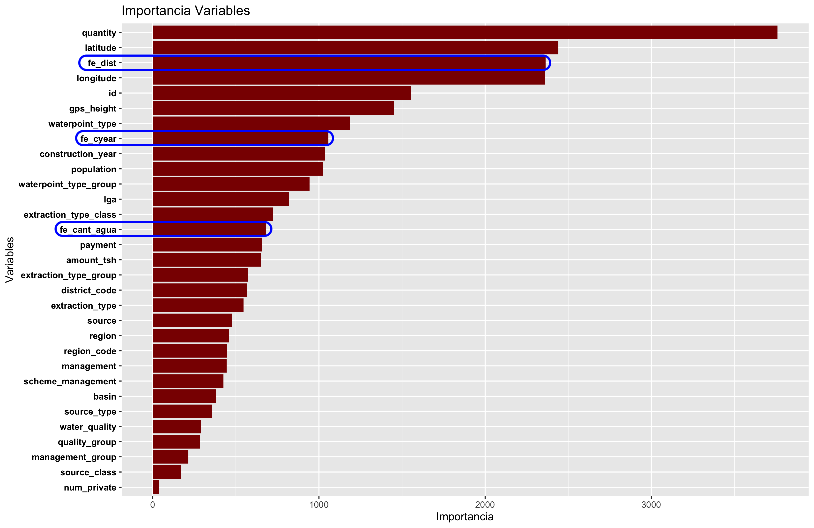
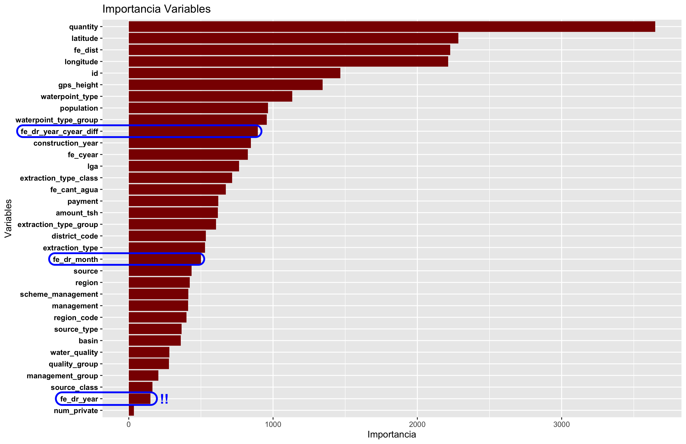

```{r setup, include=FALSE}
knitr::opts_chunk$set(echo = TRUE)
```

__Nota__: para la realización de la práctica, y a lo largo del concurso, __se ha tomado como base el _score_ obtenido en el modelo 2 realizado en clase:__

1. Selección de variables numéricas y categóricas (con al menos dos categorías y menos de 1000), además de descartar las variables duplicadas _payment_type_ y _quantity_group_, obteniendo la siguiente puntuación:

```{r, echo=FALSE}
knitr::kable(data.frame("Train accuracy" = 0.8168687, 
                        "Data Submission" = 0.8128,
                        row.names = c("Num + Cat (> 1 & < 1000) sin duplicados")),
             align = 'c')
```

# 1. Carga de datos y librerías

Para la realización de la práctica, los ficheros utilizados son los siguientes:

1. _train_values.csv_: __fichero con el conjunto de variables y observaciones con los que entrenar el modelo__.

2. _train_labels.csv_: __fichero con las variables objetivo de cada una de las observaciones en _train_values.csv___:

* 2.1 _functional_

* 2.2 _non functional_

* 2.3 _functional needs repair_

3. _test_values.csv_: __fichero de prueba con el que maximizar las predicciones obtenidas con el correspondiente modelo__

En relación con las librerías empleadas, debemos destacar las siguientes:

```{r}
#--- Librerias empleadas
suppressPackageStartupMessages({
  library(dplyr)          # Manipulacion de datos 
  library(data.table)     # Lectura y escritura de ficheros
  library(ggplot2)        # Representacion grafica
  library(inspectdf)      # EDAs automaticos
  library(ranger)         # randomForest (+ rapido que caret)
  library(forcats)        # Tratamiento de variables categoricas
  library(tictoc)         # Calculo de tiempo de ejecucion
  library(missRanger)     # Imputacion de valores NA
  library(knitr)          # Generacion de informes (formateo de tablas)
  library(gmt)            # Calculo de la distancia geografica
  library(stringi)        # Tratamiento de strings
})
```
```{r}
#--- Carga de ficheros train y test
dattrainOr    <- fread(file = "../data/train_values.csv", data.table = FALSE )
dattrainLabOr <- fread(file = "../data/train_labels.csv", data.table = FALSE )
dattestOr     <- fread(file = "../data/test_values.csv", data.table = FALSE  )
```

# 2. Desarrollo durante el concurso

## 2.1 Análisis de variables existentes
En primer lugar, en base a las funciones disponibles en la librería _inspectdf_, __se extrajo un esquema inicial con las variables existentes en el conjunto de datos y su correspondiente tipo__:

```{r, fig.align='center'}
# Analizamos el tipo de dato en cada variable
show_plot(inspect_types(dattrainOr))
```
En conjunto, nos encontramos con:

1. __27 variables variables de tipo carácter (categóricas)__
2. __10 variables numéricas (entre _integer_ y _numeric_)__
3. __2 variables lógicas__
4. __1 variable tipo fecha__

Por tanto, del mismo modo que lo realizado en el modelo 2:

1. __Conservamos únicamente las variables numéricas y categóricas con más de uno y menos de 100 valores diferentes__:

```{r}
#-- Variables categoricas
datcat_df <- dattrainOr %>% select(where(is.character))
```

```{r}
# Mediante un bucle for, 
numlev_df <- data.frame(
                          "vars" = names(datcat_df),
                           "levels" = apply(datcat_df, 2, 
                                  function(x) length(unique(x)))
                          
                        )
# Eliminamos los nombres de fila
rownames(numlev_df) <- NULL

kable(numlev_df %>% arrange(levels))
```

Por tanto, escogemos desde la variable _source_class_ hasta _lga_, dado que _recorded_by_ solo presenta una única categoría:

```{r}
#-- Conservamos variables con categorias > 1 & < 1000
vars_gd <- numlev_df %>%
  filter(levels < 1000, levels > 1) %>% 
  select(vars)
datcat_gd <- datcat_df[ , vars_gd$vars]
```

```{r}
#-- Variables numericas
datnum_df <- dattrainOr %>% select(where(is.numeric))
```

```{r}
# Unificamos ambos tipos de variables...
datnumcat_df <- cbind(datnum_df, datcat_gd)
```

```{r}
# ...Como tambien la variable objetivo
dattrainOrlab <- merge(
  datnumcat_df, dattrainLabOr,
  by.x = c('id'), by.y = c('id'),
  sort = FALSE
)
```

2. __Eliminación de variables con información duplicada__, concretamente _payment_type_ y _quantity_group_:

```{r}
dattrainOrlab$payment_type <- NULL
dattrainOrlab$quantity_group <- NULL
```

## 2.1 Tratamiento de valores anómalos

Una vez pre-procesado el conjunto de entrenamiento, una de las primeras ideas que se tuvo en cuenta fue __el tratamiento de valores anómalos, concretamente a cero, de determinadas variables__, anotados durante la primera fase de análisis exploratorio realizada en clase:

1. _construction_year_

2. _gps_height_: en el caso de la altura GPS, __no se han considerado los valores negativos como valores anómalos__, principalmente porque, traslando el problema a un entorno real, es posible la existencia de alturas negativas (regiones situadas por debajo del nivel del mar).

3. _longitude_

Sobre dichas variables podemos observar en los siguientes histogramas una elevada concentración de valores a cero:

```{r, fig.align = 'center', fig.width=8}
# Graficos de distribucion
# Histograms for numeric columns
show_plot(
  inspect_num(dattrainOrlab[c("construction_year",
                              "gps_height",
                              "longitude")])
  
)
```

Por tanto, para eliminar y posteriormente imputar dichos ceros, __haremos uso de una función denominada impute_zeros__, la cual permite establecer inicialmente a NA los valores a cero, así como su posterior imputación haciendo uso de la librería _missRanger_.

__Nota__: a lo largo de la memoria se definen varias funciones que se emplean comunmente tanto en el concurso como en el desarrollo individual, evitando con ello la redundancia de código.

```{r}
# Funcion para la imputacion de ceros con missRanger
impute_zeros <- function(data, column, k, num_trees, impute = TRUE, seed = 1234) {
  new_feature <- paste0("fe_", column)
  
  data[, new_feature] <- data[, column]
  data[, new_feature] <- ifelse( 
                            data[, new_feature] == 0, 
                            NA, 
                            data[, new_feature]
  )
  original_data       <- data[, new_feature]
  
  data[, column]      <- NULL
  
  if (impute == TRUE) {
    data_imp <- missRanger(
                            data,  
                            pmm.k = k,
                            num.trees = num_trees,
                            seed = seed
                           )
    # Finalmente, creamos una nueva columna binaria
    # 1 = el valor era NA; 0 = No
    new_feature_na      <- paste0("fe_", column, "_na")
    data_imp[, new_feature_na] <- ifelse(
                                    is.na(original_data),
                                    1,
                                    0
    )
  }
  return(data_imp)
}
```

Una vez definida la funcion, imputamos cada una de las columnas anteriores, __no sin antes eliminar la columna _status_group_, con el objetivo de evitar que la imputación también dependa del valor de la variable objetivo__. Además, en lugar de utilizar k = 3 como número de vecinos, durante el concurso se aumentó dicho valor a 5, con el objetivo de comprobar si el resultado mejoraba con respecto a lo obtenido en clase:

```{r}
# Almacenamos en un vector la variable objetivo
status_group_vector        <- dattrainOrlab$status_group
dattrainOrlab$status_group <- NULL
```
```{r, eval = FALSE}
#--- construction_year
# 
dattrainOrlab_imp <- impute_zeros(dattrainOrlab,
                                  column = "construction_year",
                                  k = 5,
                                  num_trees = 100)
```

```{r, eval = FALSE}
#--- gps_heigth
dattrainOrlab_imp <- impute_zeros(dattrainOrlab_imp,
                                  column = "gps_height",
                                  k = 5,
                                  num_trees = 100)
```

```{r, eval = FALSE}
#--- longitude
dattrainOrlab_imp <- impute_zeros(dattrainOrlab_imp,
                                  column = "longitude",
                                  k = 5,
                                  num_trees = 100)
```

Tras la imputación, añadimos nuevamente la variable objetivo al conjunto de entrenamiento:

```{r,eval=FALSE}
dattrainOrlab_imp$status_group <- status_group_vector
dattrainOrlab_imp$status_group <- as.factor(dattrainOrlab_imp$status_group)
```

En relación con el conjunto _test_, dado que no debemos aplicar la imputación de los valores _missing_ a partir del propio conjunto _test_, a cada valor NA (es decir, igual a cero), se tomó la decisión de __imputarlo por un valor muy diferente al resto de la población__, concretamente 99999, así como añadir una columna binaria adicional que indice si el valor imputado era o no un valor _missing_:

```{r, eval=FALSE}
dattestOr_imp <- dattestOr

for(column in c("construction_year", "gps_height", "longitude")) {
  new_feature <- paste0("fe_", column)
  dattestOr_imp[, new_feature] <- ifelse(
                                          dattestOr_imp[, column] == 0,
                                          99999,
                                          dattestOr_imp[, column]
  )
  dattestOr_imp[, column] <- NULL
  
  new_feature_na <- paste0("fe_", column, "_na")
  dattestOr_imp[, new_feature_na] <- ifelse(
                                          dattestOr_imp[, new_feature] == 99999,
                                          1,
                                          0
  ) 
}
```

Una vez imputadas las variables, por medio de la función _ranger_ creamos un primer modelo de _Random Forest_:

```{r}
# Funcion que devuelve un modelo Random Forest entrenado
fit_random_forest <- function(formula, data, num_trees = 500, mtry = NULL, seed = 1234) {
  tic()
  my_model <- ranger( 
    formula, 
    importance = 'impurity',
    data       = data,
    num.trees = num_trees,
    mtry = mtry,
    verbose = FALSE,
    seed = seed
  )
  # **Estimacion** del error / acierto **esperado**
  success <- 1 - my_model$prediction.error
  print(success)
  toc()
  
  return(my_model)
}
```

De forma adicional, creamos una función que permita crear un grafico con la importancia de las variables del modelo pasado como argumento, así como almacenar el gráfico en disco:

```{r}
#--- Funcion para pintar importancia de variables (ademas de guardar el grafico)
save_importance_ggplot <- function(model, path) {
  impor_df <- as.data.frame(model$variable.importance)
  names(impor_df)[1] <- c('Importance')
  impor_df$vars <- rownames(impor_df)
  rownames(impor_df) <- NULL
  
  print(ggplot(impor_df, aes(fct_reorder(vars, Importance), Importance)) +
    geom_col(group = 1, fill = "darkred") +
    coord_flip() + 
    labs(x = 'Variables', y = 'Importancia', title = 'Importancia Variables') +
    theme_bw())
  ggsave(path)
}
```

```{r, eval = FALSE}
formula    <- as.formula('status_group~.')

my_model_1 <- fit_random_forest(formula, dattrainOrlab_imp)
```
```
[1] 0.8101178
34.328 sec elapsed
```

Tras crear el modelo, guardamos el gráfico con la importancia de cada una de las variables:

```{r, eval=FALSE}
save_importance_ggplot(my_model_1, '../charts/01_num_cat_menos1000_todo_imp.png')
```


Analizando el gráfico de importancia, observamos que las variables imputadas (año de construcción, altura GPS y longitud) presentan una elevada importancia. No obstante, las variables "_na" no parecen aportar una importancia relevante al modelo. No obstante, realizamos las predicciones y comparamos el _score_ obtenido:

```{r}
#--- Funcion para realizar prediccion sobre el modelo pasado como parametro
make_predictions <- function(model, test_data) {
  # Prediccion
  my_pred <- predict(model, test_data)
  
  # Submission
  my_sub <- data.table(
    id = test_data[, "id"],
    status_group = my_pred$predictions
  )
  
  return(my_sub)
}
```
```{r, eval = FALSE}
my_sub_1 <- make_predictions(my_model_1, dattestOr_imp)
# guardo submission
fwrite(my_sub_1, file = "../submissions/01_num_cat_menos1000_todo_imp.csv")
```

```{r, echo=FALSE}
knitr::kable(data.frame("Train accuracy" = c(0.8168687, 0.8101178), 
                        "Data Submission" = c(0.8128, 0.8096),
            row.names = c("Num + Cat (> 1 & < 1000) sin duplicados",
            "Num + Cat (> 1 & < 1000) sin duplicados imp")),
align = 'c')
```

Como podemos comprobar, el hecho de imputar las variables anteriores no ha mejorado el modelo. Sin embargo, ¿Y si eliminamos las variables "_na" anteriores?

```{r, eval=FALSE}
dattrainOrlab_imp_sin_col_na <- dattrainOrlab_imp
# Eliminamos las columnas "_na"
dattrainOrlab_imp_sin_col_na$fe_construction_year_na <- NULL
dattrainOrlab_imp_sin_col_na$fe_gps_height_na        <- NULL
dattrainOrlab_imp_sin_col_na$fe_longitude_na         <- NULL

# Idem con los datos test
dattestOr_imp_sin_col_na    <- dattestOr_imp
# Eliminamos las columnas "_na"
dattestOr_imp_sin_col_na$fe_construction_year_na <- NULL
dattestOr_imp_sin_col_na$fe_gps_height_na        <- NULL
dattestOr_imp_sin_col_na$fe_longitude_na         <- NULL
```

```{r, eval = FALSE}
my_model_1_sin_cols_na <- fit_random_forest(formula, dattrainOrlab_imp_sin_col_na)
```

```
[1] 0.8105724
43.627 sec elapsed
```

En relación con el conjunto _train_, parece mejorar ligeramente (de 0.8101178 a 0.8105724). Analicemos el conjunto _test_:

```{r, eval = FALSE}
my_sub_1_sin_cols_na <- make_predictions(my_model_1_sin_cols_na, dattestOr_imp_sin_col_na)
# guardo submission
fwrite(my_sub_1_sin_cols_na, file = "../submissions/01_num_cat_menos1000_todo_imp_sin_cols_na.csv")
```

```{r, echo=FALSE}
knitr::kable(data.frame("Train accuracy" = c(0.8168687, 0.8101178, 0.8105724), 
                        "Data Submission" = c(0.8128, 0.8096, 0.8081),
            row.names = c("Num + Cat (> 1 & < 1000) sin duplicados",
            "Num + Cat (> 1 & < 1000) sin duplicados imp", 
            "Num + Cat (> 1 & < 1000) sin duplicados imp sin cols na")),
align = 'c')
```

Podemos comprobar que, pese a eliminar variables con muy poca importancia, el modelo empeora.

## 2.2 Creación de nuevas variables
En vistas a los resultados obtenidos en el apartado anterior, se decidió no imputar dichas variables y buscar una alternativa a la mejora del modelo. Para ello, se recurrió a la creación de nuevas variables o _feature engineering_:

1. _construction_year_: __antigüedad del pozo__, restando la fecha más reciente (2014) a cada uno de los valores.

2. _longitude_ y _latitude_: __distancia geográfica__. En lugar de la raíz cuadrada de la suma de las coordenadas al cuadrado, _R_ dispone de un paquete denominado _gmt_ con el que calcular la distancia geográfica de cada bomba al punto de referencia (0,0), obteniendo distancias más precisas que con un cálculo Euclideo.

3. _amount_tsh_ y _population_: analizando el gráfico de importancia del primer modelo, se comprobó que variables como la población o la cantidad de agua disponible no son especialmente relevantes. Como consecuencia, se propuso la creación de una nueva variable, basada en la __cantidad de agua que habría disponible por persona en cada pozo__, dividiendo la cantidad total de agua en cada observación ( _amount_tsh_ ) entre el total de población.

```{r}
#---- Feature Engineering
#---  Creacion de nuevas variables
#--   Antiguedad del pozo (2014 - fecha)
# Train
dattrainOrlab$fe_cyear <- 2014 - dattrainOrlab$construction_year

# Test
dattestOr$fe_cyear <- 2014 - dattestOr$construction_year
```
```{r}
#--   Distancia geografica al punto (0,0)
# geodist (latitud_origen, longitud_origen, latitud_destino, longitud_destino)
# Por defecto, las unidades estan expresadas en kilometros
# Train
dattrainOrlab$fe_dist <- geodist(dattrainOrlab$latitude, dattrainOrlab$longitude, 0, 0)

# Test
dattestOr$fe_dist <- geodist(dattestOr$latitude, dattestOr$longitude, 0, 0)
```
```{r}
#--  Cantidad de agua disponible por persona
# Train
dattrainOrlab$fe_cant_agua <- ifelse(dattrainOrlab$population == 0,
                                     0,
                                    round(dattrainOrlab$amount_tsh /
                                            dattrainOrlab$population, 3)
                              )

# Test
dattestOr$fe_cant_agua <- ifelse(dattestOr$population == 0,
                                 0,
                                round(dattestOr$amount_tsh /
                                      dattestOr$population, 3)
                              )
```

Una vez creadas las variables, entrenamos nuevamente el modelo _random forest_:

```{r}
# Inclimos la variable objetivo
dattrainOrlab$status_group <- status_group_vector
dattrainOrlab$status_group <- as.factor(dattrainOrlab$status_group)
```
```{r, eval = FALSE}
my_model_2 <- fit_random_forest(formula, dattrainOrlab)
```

A simple vista, el valor obtenido en el conjunto de entrenamiento mejora de 0.810 en el caso anterior a 0.812. Veamos el resultado obtenido en la _submission_:

```
[1] 0.8122391
42.519 sec elapsed
```

```{r, eval = FALSE}
#- Guardamos el grafico con la importancia del modelo
save_importance_ggplot(my_model_2, '../charts/02_num_cat_menos1000_fe_cyear_dist_cant_agua.png')
```



De forma general, las variables creadas se sitúan entre las variables con mayor importancia (a excepción de _fe_cant_agua_). A continuación, si analizamos las predicciones obtenidas en el conjunto test:

```{r, eval = FALSE}
my_sub_2 <- make_predictions(my_model_2, dattestOr)
# guardo submission
fwrite(my_sub_2, file = "../submissions/02_num_cat_menos1000_fe_cyear_dist_cant_agua.csv")
```

```{r, echo=FALSE}
knitr::kable(data.frame("Train accuracy" = c(0.8168687, 0.8101178, 0.8105724, 0.8122391), 
                        "Data Submission" = c(0.8128, 0.8096, 0.8081, 0.8174),
            row.names = c("Num + Cat (> 1 & < 1000) sin duplicados",
            "Num + Cat (> 1 & < 1000) sin duplicados imp", 
            "Num + Cat (> 1 & < 1000) sin duplicados imp sin cols na",
            "Num + Cat (> 1 & < 1000) fe cyear + dist + cant_agua")),
align = 'c')
```

## 2.3 Inclusión de _date_recorded_

Con la inclusión de las nuevas variables, el resultado mejoró con respecto a los dos _submission_ anteriores, por lo que se decidió mantener cada una ellas. En relación con la siguiente prueba, se tomó la decisión de incluir una variable adicional que hasta el momento no se había tenido en cuenta: _date_recorded_. Dado que la variable se encuentra en formato fecha, en lugar de incluir directamente el campo se dividió en un total de tres nuevas variables:

1. __Año__
2. __Mes__
3. __Diferencia entre la fecha de observación y la fecha de construcción de la bomba__, de forma que se pueda tener una columna que indique su antigüedad en el momento en el que se insertó la fila:

```{r}
#-- date_recorded --> año
#   Train
dattrainOrlab$fe_dr_year <- year(dattrainOr$date_recorded)

#   Test
dattestOr$fe_dr_year     <- year(dattestOr$date_recorded)
```

```{r}
#-- date_recorded --> mes
#   Train
dattrainOrlab$fe_dr_month <- month(dattrainOr$date_recorded)

#   Test
dattestOr$fe_dr_month     <- month(dattestOr$date_recorded)
```

En relación a la diferencia entre _date_recorded_ y _construction_year_, llamó la atención la __diferencia negativa entre en algunas observaciones__, es decir, bombas de agua en las que la fecha de registro fue posterior a la fecha de su construcción:

```{r}
#-- date_recorded --> año date_recorded - año construction_date
#   Train
dattrainOrlab$fe_dr_year_cyear_diff <- dattrainOrlab$fe_dr_year - dattrainOrlab$construction_year

#   Test
dattestOr$fe_dr_year_cyear_diff     <- dattestOr$fe_dr_year - dattestOr$construction_year
```

```{r}
sum(dattrainOrlab$fe_dr_year_cyear_diff < 0) # Train
sum(dattestOr$fe_dr_year_cyear_diff < 0)     # Test
```

Nuevamente, tras crear las variables entrenamos el modelo _random forest_:

```{r, eval = FALSE}
#-- Modelo 3
my_model_3 <- fit_random_forest(formula, dattrainOrlab)
```

```
[1] 0.8115152
40.562 sec elapsed
```

En relación al conjunto _train_ anterior, ha mejorado considerablemente ¿Y en relación gráfico de importancia?

```{r, eval = FALSE}
#- Guardamos el grafico con la importancia del modelo
save_importance_ggplot(my_model_3, '../charts/03_num_cat_menos1000_fe_cyear_dist_cant_agua_dr_year_month_old.png')
```



Salvo la variable _fe_dr_year_ (año de _date_recorded_), por lo general son variables relevantes. Además, si analizamos el conjunto _test_:

```{r, eval=FALSE}
my_sub_3 <- make_predictions(my_model_3, dattestOr)
# guardo submission
fwrite(my_sub_3, 
    file = "../submissions/03_num_cat_menos1000_fe_cyear_dist_cant_agua_dr_year_month_old.csv")
```

```{r, echo=FALSE}
knitr::kable(data.frame("Train accuracy" = c(0.8168687, 0.8101178, 0.8105724, 0.8122391, 0.8115152), 
                        "Data Submission" = c(0.8128, 0.8096, 0.8081, 0.8174, 0.8176),
            row.names = c("Num + Cat (> 1 & < 1000) sin duplicados",
            "Num + Cat (> 1 & < 1000) sin duplicados imp", 
            "Num + Cat (> 1 & < 1000) sin duplicados imp sin cols na",
            "Num + Cat (> 1 & < 1000) fe cyear + dist + cant_agua",
            "Num + Cat (> 1 & < 1000) fe cyear + dist + cant_agua + dr_year + dr_month + abs(dr_year -cyear)")),
align = 'c')
```

Por lo general, __el modelo ha mejorado de 0.8174 a 0.8176__. Sin embargo, no todas las variables son de especial importancia, como es el caso de _fe_dr_year_ ¿Y si eliminamos dicha variable?

```{r}
dattrainOrlab$fe_dr_year <- NULL
dattestOr$fe_dr_year     <- NULL
```

```{r, eval=FALSE}
# Calculamos el nuevo modelo
my_model_3_sin_dr_year <- fit_random_forest(formula, dattrainOrlab)
```

```
[1] 0.812138
39.71 sec elapsed
```

```{r, eval=FALSE}
my_sub_3_sin_dr_year <- make_predictions(my_model_3_sin_dr_year, dattestOr)
# guardo submission
fwrite(my_sub_3_sin_dr_year, 
    file = "../submissions/03_num_cat_menos1000_fe_cyear_dist_cant_agua_month_old.csv")
```

```{r, echo=FALSE}
knitr::kable(data.frame("Train accuracy" = c(0.8168687, 0.8101178, 0.8105724, 0.8122391, 0.8124579, 0.812138), 
                        "Data Submission" = c(0.8128, 0.8096, 0.8081, 0.8174, 0.8176, 0.8176),
            row.names = c("Num + Cat (> 1 & < 1000) sin duplicados",
            "Num + Cat (> 1 & < 1000) sin duplicados imp", 
            "Num + Cat (> 1 & < 1000) sin duplicados imp sin cols na",
            "Num + Cat (> 1 & < 1000) fe cyear + dist + cant_agua",
            "Num + Cat (> 1 & < 1000) fe cyear + dist + cant_agua + dr_year + dr_month + dr_year -cyear",
            "Num + Cat (> 1 & < 1000) fe cyear + dist + cant_agua + dr_month + dr_year -cyear")),
align = 'c')
```

Prácticamente, obtuvimos el mismo resultado eliminando el año de _date_recorded_, por lo que se decidió no tener en cuenta dicha variable.

## 2.4 Tuneo modelo final

Como se ha podido comprobar en la tabla anterior, aumenta ligeramente el valor de __accuracy__ al añadir las dos nuevas variables. Por tanto, como última _submission realizada en clase_ se realizó un tuneo de hiperparámetros del modelo _random forest_, empleando todos los parámetros utilizados hasta el momento.

```{r, eval=FALSE}
my_ntree <- c(500, 600, 700, 800)
my_mtry  <- c(5, 6, 7, 10)
my_pars  <- expand.grid(my_ntree, my_mtry)
names(my_pars) <- c('myntree', 'mymtry')
my_pars$accuracy <- 0

for (i in 1:nrow(my_pars)) {
   my_model_tuning <- fit_random_forest(formula, dattrainOrlab,
                                        num_trees = my_pars$myntree[[i]],
                                        mtry = my_pars$mymtry[i])
   my_pars$accuracy[i] <- (1 - my_model_tuning$prediction.error)
}
rm(my_model_tuning)
```

Tras realizar el tuneo de hiperparámetros, comprobamos qué modelo obtiene un mayor _accuracy_:

```{r}
load("../rdata/00.RData")
my_pars[which(my_pars$accuracy == max(my_pars$accuracy)), ]
```

```{r, eval=FALSE}
#-- Entrenamos el modelo con 700 arboles y mtry = 6
my_model_4 <- fit_random_forest(formula, dattrainOrlab, num_trees = 700, mtry = 6)
```

```
[1] 0.8137374
76.683 sec elapsed
```

Finalmente, guardamos el gráfico de importancias y exportamos las predicciones obtenidas:

```{r, eval=FALSE}
#- Guardamos el grafico con la importancia del modelo
save_importance_ggplot(my_model_4, '../charts/04_num_cat_menos1000_fe_tunned.png')
```

```{r, eval=FALSE}
my_sub_4 <- make_predictions(my_model_4, dattestOr)
# guardo submission
fwrite(my_sub_4, 
    file = "../submissions/04_num_cat_menos1000_fe_tunned.csv")
```

```{r, echo=FALSE}
knitr::kable(data.frame("Train accuracy" = c(0.8168687, 0.8101178, 0.8105724, 0.8122391, 0.8124579, 0.812138, 0.8137374), 
                        "Data Submission" = c(0.8128, 0.8096, 0.8081, 0.8174, 0.8176, 0.8176, 0.8172),
            row.names = c("Num + Cat (> 1 & < 1000) sin duplicados",
            "Num + Cat (> 1 & < 1000) sin duplicados imp", 
            "Num + Cat (> 1 & < 1000) sin duplicados imp sin cols na",
            "Num + Cat (> 1 & < 1000) fe cyear + dist + cant_agua",
            "Num + Cat (> 1 & < 1000) fe cyear + dist + cant_agua + dr_year + dr_month + dr_year -cyear",
            "Num + Cat (> 1 & < 1000) fe cyear + dist + cant_agua + dr_month + dr_year -cyear", 
            "Num + Cat (> 1 & < 1000) fe + tunning random forest")),
align = 'c')
```

# 3. Mejora del modelo tras el concurso

Tras el concurso, por cuenta propia se ha decidido partir del mejor modelo obtenido hasta el momento, correspondiente con:

1. Variables numéricas
2. Variables categóricas
3. _Feature Engineering_: _cyear_, _dist_, _cant_agua_, _dr_month_ y _dr_year_ - _cyear_

Sobre dicho modelo, se ha obtenido una mejor puntuación de 0.812138 en el conjunto _train_ y 0.8176 en el conjunto de prueba, por lo que el objetivo consistirá en superar dicho _accuracy_, junto el mejor _accuracy_ alcanzado en el grupo en conjunto (0.8180), así como la mejor puntuación obtenida por el grupo ganador (0.8248).

```{r, echo=FALSE}
rm(list = ls())
```

__Importante__: con el objetivo de evitar redundancia de código, el conjunto de datos obtenidos en la fase anterior se han almacenado en ficheros csv denominados _train_values_concurso.csv_ y _test_values_concurso.csv_. Además, de ahora en adelante se trabajará con _data.table_ en lugar de _data.frames_, con fines únicamente didácticos (aprender una nueva estructura de datos):

```{r}
# Volvemos a cargar dattrainOr, ya que contiene la columna status_group
dattrainOr       <- fread(file = "../data/train_values.csv", data.table = FALSE)

dattrainOrlab    <- fread(file = "../data/train_values_concurso.csv", data.table = FALSE )
dattestOr        <- fread(file = "../data/test_values_concurso.csv", data.table = FALSE  )
```

Una vez cargados ambos datos (entrenamiento y prueba), se tomó la decisión de juntar ambos ficheros en una única variable (dat_completo), evitando de este modo la duplicidad en el código. Por tanto, y dado que el conjunto _test_ no dispone de la columna _status_group_, almacenamos la variable objetivo del conjunto _train_ en un vector:

```{r}
vector_status_group        <- dattrainOrlab$status_group
dattrainOrlab$status_group <- NULL

#-- Nos traemos funder, ward (menos de 2100 categorias)
#   Para el siguiente apartado
dattrainOrlab$funder <- dattrainOr$funder
dattrainOrlab$ward <- dattrainOr$ward

# Creamos el dataset completo (train y test unidos)
columnas_test  <- names(dattestOr)[names(dattestOr) %in% names(dattrainOrlab)]
datcompleto <- rbind(dattrainOrlab, dattestOr[, columnas_test])
datcompleto <- as.data.table(datcompleto)
```

Además, de cara a la posterior separación del conjunto _train_ y _test_ para el entrenamiento, almacenamos en una variable el número de fila __a partir del cual comienza el conjunto _test__:

```{r}
# El conjunto test empieza a partir de la 59401
# 50785: primer id del conjunto test
fila_test <- which(datcompleto$id == 50785)
```

## 3.1 Incluyendo variables < 2100 valores únicos

Hasta ahora, hemos incluido variables con menos de 1000 categorias únicas, esto es, hasta la variable _lga_. Durante el concurso, no se tuvieron en cuenta, dado que sel objetivo fue maximizar el _score_ del modelo sin necesidad de recurrir a variables con un alto número de categorías. Por ello, de cara a la parte individual se tomó la decisión de trabajar sobre dichos campos.

Con el objetivo de seguir un orden y __no incluir todas las variables "de forma abrupta"__, comenzamos con aquellas con menos de 2100 categorías, esto es, _funder_ y _ward_:

```{r}
#--- Niveles de las categoricas.
datcat_df <- as.data.frame(datcompleto %>% select(where(is.character)))

numlev_df <- data.frame()
for (i in 1:ncol(datcat_df)) {
  col_tmp <- datcat_df[, i]
  num_lev <- length(unique(col_tmp))
  numlev_df[i, 1] <- names(datcat_df)[i]
  numlev_df[i, 2] <- num_lev
}
names(numlev_df) <- c('vars', 'levels')
numlev_df %>% arrange(levels)
```

Dado que existen demasiadas categorías, podemos preguntarnos si realmente existen 2098 y 2141 valores unicos en _ward_ y _funder_, respectivamente. De hecho, podemos comprobar como algunas de las categorías se diferencian por tan solo una o dos palabras:

```
Lgcdg   - Lgcbg  # En el caso de funder
Magole  - Magoma # En el caso de ward
```

Es decir, se tratan de regiones "alfabeticamente" muy similares. Por tanto, ¿quién nos asegura que dos o más categorías se diferencien por tan solo un espacio en blanco, una palabra en mayúscula o por signos de puntuación? Como consecuencia, antes de procesar un modelo se tomó la decisión de __realizar una limpieza sobre ambas columnas, con el propósito de comprobar si se reduce el número de valores únicos__. Para ello, empleamos la librería __stringi__, creando una función que permita filtrar:

1. Mayúsculas
2. Espacios en blanco
3. Signos de puntuación

```{r}
# Funcion para limpieza de strings (vectorizado)
clean_text <- function(text) {
  stri_trans_tolower(
    stri_replace_all_regex(
      text, 
      pattern = "[ +\\p{Punct}]", 
      replacement = ""
      )
    )
}
```

Una vez creada la función,la aplicamos sobre el _data.table_:

```{r}
datcompleto[, fe_funder := clean_text(funder)][, fe_ward := clean_text(ward)]
```

Tras aplicar dicha función, comprobamos si el número de categorías se ha visto reducido:

```{r}
datcat_df <- as.data.frame(datcompleto %>% select(where(is.character)))

numlev_df <- data.frame()
for (i in 1:ncol(datcat_df)) {
  col_tmp <- datcat_df[, i]
  num_lev <- length(unique(col_tmp))
  numlev_df[i, 1] <- names(datcat_df)[i]
  numlev_df[i, 2] <- num_lev
}
names(numlev_df) <- c('vars', 'levels')
numlev_df %>% arrange(levels)
```

Analizando la salida anterior, podemos comprobar como el número de categorías se ha visto reducido ligeramente en ambas columnas:

1. _ward_  : de 2096 a 2098
2. _funder_: de 2141 a 2110

Una vez creadas las nuevas columnas, eliminamos las originales y lanzamos el modelo:

```{r}
datcompleto[, c("ward", "funder") := NULL]
```

```{r, eval=FALSE}
#-- Modelo
# Dividimos entre conjunto de entrenamiento y prueba
train <- datcompleto[c(1:fila_test-1),]
train$status_group <- vector_status_group
train$status_group <- as.factor(train$status_group)

test <- datcompleto[c(fila_test:nrow(datcompleto)),]

formula   <- as.formula("status_group~.")

# Empleamos la funcion fit_random_forest definida anteriormente
my_model_5 <- fit_random_forest(formula, train)
```

```
[1] 0.8149832
39.414 sec elapsed
```

Tras crear el modelo, echemos un vistazo a la importancia de las variables:

```{r, eval=FALSE}
save_importance_ggplot(my_model_5, '../charts/05_04_mas_fe_inst_funder_scheme_ward.png')
```


Observamos que ambas variables se sitúan entre las variables con mayor relevancia (importancia en torno a 1000). Veamos si con el conjunto _test_ obtenemos un mejor _score_:

```{r, eval=FALSE}
my_sub_5 <- make_predictions(my_model_5, dattestOr)
# guardo submission
fwrite(my_sub_5, 
    file = "../submissions/05_04_mas_fe_inst_funder_scheme_ward.csv")
```

```{r}
knitr::kable(data.frame("Train accuracy" = c('-', 0.8149832), 
                        "Data Submission" = c(0.8180, 0.8197),
                        row.names = c("Mejor accuracy en el concurso",
                                      "Num + Cat (> 1 & < 2100) fe anteriores + fe_funder + fe_ward")),
             align = 'c')
```

Aparentemente, hemos conseguido un mejor _score_ que el obtenido en clase.

## 3.2 Aplicando lumping sobre ward y funder

Tras la mejora en el modelo anterior, todavía quedan demasiadas categorías en _ward_ y _funder_, concretamente 2098 y 2110 categorías, respectivamente. Además, si echamos un vistazo a la proporción de aparición de las diferentes categorías de cada variable:

```{r}
summary(c(prop.table(table(datcompleto[, fe_ward])))) # fe_ward
```

```{r}
summary(c(prop.table(table(datcompleto[, fe_funder])))) # fe_funder
```

Observamos que __muchas de las categorías aperecen con muy poca frecuencia__. Por ejemplo, si nos fijamos en la mediana vemos que la mitad de las categorías de _fe_ward_ aparecen con una proporción igual o inferior a 3.37e-04, así como en _fe_funder_, con una proporción aún más pequeña (del orden de 10e-5).

Por tanto, una posibilidad sería __aplicar lumping sobre aquellas categorías con una proporción de aparición muy pequeña__. En un primer comienzo, podemos aplicarlo sobre la mediana

```{r}
summary(c(prop.table(table(datcompleto[, fe_funder]))))
datcompleto[, fe_funder := fct_lump_prop(datcompleto[,fe_funder], 2e-05, other_level = "other")]
datcompleto$fe_funder <- as.character(datcompleto$fe_funder)
# Pasamos de 2110 a 999 categorias

datcompleto[, funder := NULL]

#-- fe_ward
#-- Aplicamos lumping sobre la mediana (50 % de categorias con una proporcion menor a 4e-04)
summary(c(prop.table(table(datcompleto[, fe_ward]))))
datcompleto[, fe_ward := fct_lump_prop(datcompleto[,fe_ward], 4e-04, other_level = "other")]
datcompleto$fe_ward <- as.character(datcompleto$fe_ward)
# Pasamos de 2096 a 904 categorias
```

